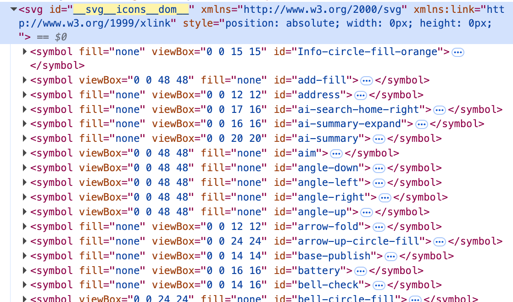

## 相关属性
### viewBox
> **viewBox = SVG 的“坐标系 + 画布窗口”**

### fill 和stroke

| 属性       | 作用     | 类比   |
| -------- | ------ | ---- |
| `fill`   | 填充图形内部 | 涂满颜色 |
| `stroke` | 绘制图形边框 | 画轮廓线 |
> **fill 是实现方式，filled 是设计风格；stroke 是实现方式，outlined 是设计风格**

### currentColor
`currentColor` = 当前元素的 `color` 值（CSS 字体颜色）
核心价值： **把“颜色控制权”从 SVG 内部，交给外部 CSS**
```html
<div style="color: red;">
  <svg fill="currentColor">
    <circle cx="50" cy="50" r="40" />
  </svg>
</div>
```

### font-size
> **font-size = SVG 的“缩放控制器”（前提是用em）**
```html
<div style="color: red; font-size: 24px;">
  <svg width="1em" height="1em" fill="currentColor">
    <path d="..." />
  </svg>
</div>
```
宽高为1em 则svg的大小会随着外部字体大小而缩放

### xlink:href / use 是干什么的
实现 SVG 图形的复用能力，类似组件系统
```html 
<svg style="display:none">
  <symbol id="icon-user" viewBox="0 0 24 24">
    <path d="..." />
  </symbol>
</svg>
```

```html
<svg>  
<use xlink:href="#icon-user"></use>  
</svg>
```
## 工程实践上
| 使用方式          | 推荐方案                       |
| ------------- | -------------------------- |
| 当图片用（img）     | asset module / file-loader |
| 变成 React 组件   | @svgr/webpack              |
| 做 icon sprite | svg-sprite-loader          |
| 优化 SVG        | svgo                       |
### svg雪碧图
对于svg的处理一般有专门的插件生成svg雪碧图 比如：`createSvgIconsPlugin` 
```js
createSvgIconsPlugin({

iconDirs: [

path.join(__dirname, '../bohrium-space/src/icons/app'),

path.join(__dirname, '../bohrium-space/src/icons/space'),

], // icon存放的目录

symbolId: '[name]', // symbol的id

inject: 'body-last', // 插入的位置

customDomId: '__svg__icons__dom__', // svg的id

}),
```


### svgo
> **SVGO 不只是压缩 SVG，而是把“设计工具导出的垃圾代码”变成“可工程化使用的干净资源”**
- 删除无用信息
- 简化路径
- 压缩体积
- 规范结构