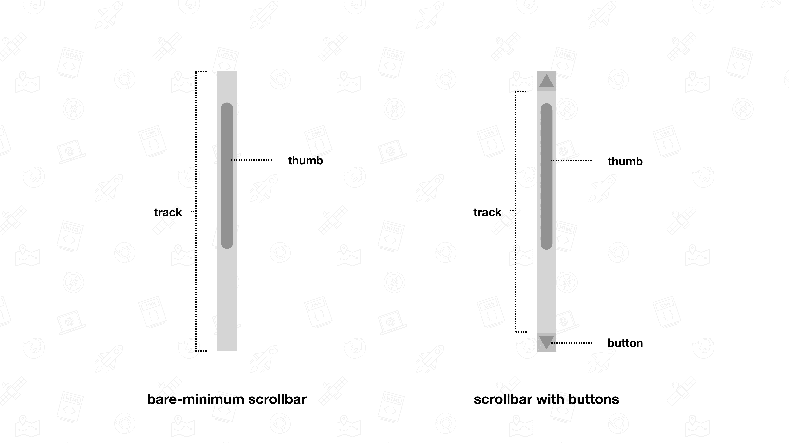
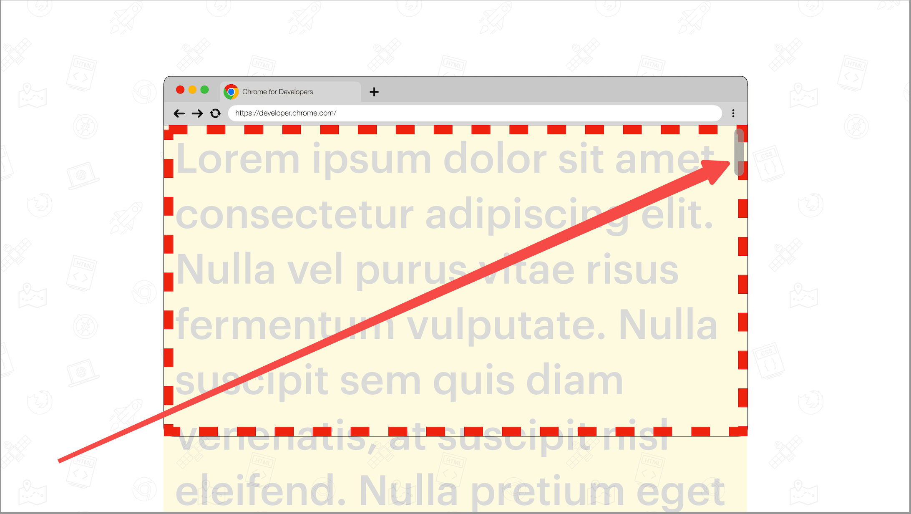
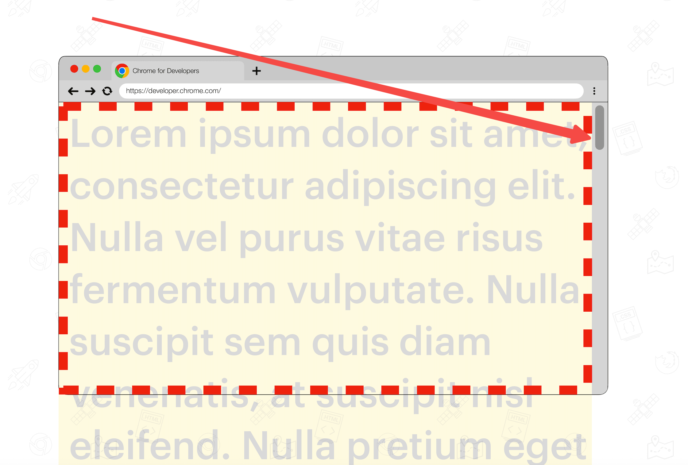

滚动条至少包含**轨道**(track)和**滑块**(thumb)

可以使用以下伪元素选择器去修改基于 webkit 的浏览器的滚动条样式：
- `::-webkit-scrollbar`——整个滚动条。
- `::-webkit-scrollbar-button`——滚动条上的按钮（上下箭头）。
- `::-webkit-scrollbar-thumb`——滚动条上的滚动滑块。
- `::-webkit-scrollbar-track`——滚动条轨道。
- `::-webkit-scrollbar-track-piece`——滚动条没有滑块的轨道部分。
- `::-webkit-scrollbar-corner`——当同时有垂直滚动条和水平滚动条时交汇的部分。通常是浏览器窗口的右下角。
- `::-webkit-resizer`——出现在某些元素底角的可拖动调整大小的滑块。
### 经典滚动条和叠加层滚动条

#### 叠加滚动条
叠加滚动条是呈现于下方内容顶部的浮动滚动条。**默认情况下，这些指示器不会显示**，只有在主动滚动时才会显示

#### 经典滚动条
经典滚动条是指放置在专用滚动条边衬区 (scrollbar gutter) 中的滚动条。滚动条边衬区是内边框边缘与外边衬区边缘之间的空间。这些滚动条通常是不透明的，会占用相邻内容的一些空间。

## `scrollbar-color` 和 `scrollbar-width` 属性
### 使用 `scrollbar-color` 为滚动条着色

借助 `scrollbar-color` 属性，您可以更改滚动条的配色方案。该属性接受两个 `<color>` 值。第一个 `<color>` 值用于确定滑块的颜色，第二个值用于确定轨道所用的颜色。
```css
.scroller {
  scrollbar-color: hotpink blue;
}
```
### 使用 `scrollbar-width` 更改滚动条的大小

借助 `scrollbar-width` 属性，您可以选择更窄的滚动条，甚至完全隐藏滚动条，而不会影响滚动功能。
接受的值包括 `auto`、`thin` 和 `none`。
- `auto`：平台提供的默认滚动条宽度。
- `thin`：平台提供的细滚动条变体，或比默认平台滚动条更细的自定义滚动条。
- `none`：有效隐藏滚动条。不过，该元素仍然可滚动。
```css
.scroller {
  scrollbar-width: thin;
}
```
但是这样不能设置px 要想设置px得用伪类
 - scroller元素要设置高度
 - scroller元素要设置overflow:hidden
```css
.scroller::-webkit-scrollbar {
  width: 8px;  /* ✅ 可以精确控制 */
}
```