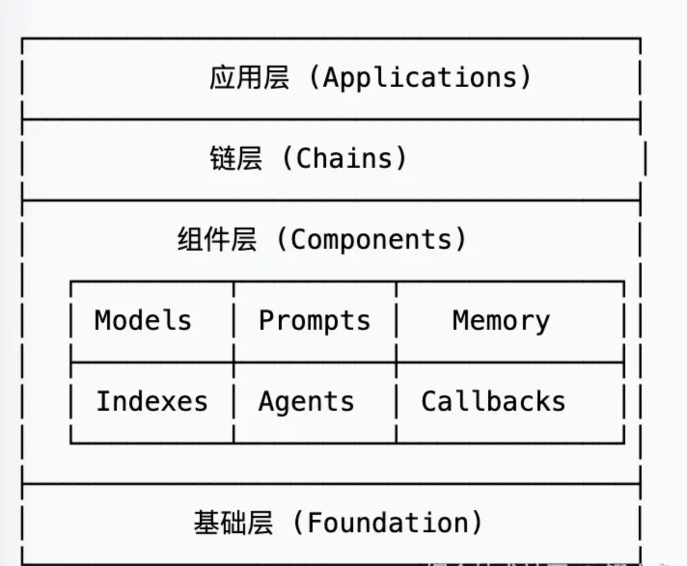

LangChain.js 是一个专为构建大语言模型（LLM）应用而设计的 JavaScript/TypeScript 框架。它的核心理念是让开发者能够轻松地将 LLM 与其他数据源和计算资源连接起来，构建智能、上下文感知的应用程序

#### 主要模块说明

**🤖 Models（模型层）**

- LLM 接口：OpenAI、Anthropic、Hugging Face 等
- Chat Models：专门用于对话的模型接口
- Embeddings：文本向量化模型

**📝 Prompts（提示层）**

- Prompt Templates：动态提示模板
- Few-shot Examples：少样本学习示例
- Output Parsers：结构化输出解析

**🧠 Memory（记忆层）**

- Conversation Memory：对话记忆
- Vector Store Memory：向量存储记忆
- Summary Memory：摘要记忆

**🔍 Indexes（索引层）**

- Document Loaders：文档加载器
- Text Splitters：文本分割器
- Vector Stores：向量数据库

**🤖 Agents（代理层）**

- Tool Integration：工具集成
- Decision Making：决策制定
- Action Execution：动作执行


###  核心概念

#### 1. Runnable 接口
LangChain.js 中的所有组件都实现了 `Runnable` 接口，这是框架的核心抽象：
```ts
interface Runnable<Input, Output> {
  invoke(input: Input): Promise<Output>;
  stream(input: Input): AsyncGenerator<Output>;
  batch(inputs: Input[]): Promise<Output[]>;
  pipe<NewOutput>(next: Runnable<Output, NewOutput>): Runnable<Input, NewOutput>;
}
```

####  链式组合（Chaining）
```
```

### 最佳实践
#### 成本控制
```ts
const model = new ChatOpenAI({
  modelName: "gpt-3.5-turbo", // 选择合适的模型
  maxTokens: 500, // 限制输出长度
  temperature: 0.7, // 适当的随机性
});

// 监控 token 使用
const response = await model.invoke(messages, {
  callbacks: [{
    handleLLMEnd: (output) => {
      console.log(`Token 使用情况:`, output.llmOutput?.tokenUsage);
    }
  }]
});

```
#### 日志追踪
```ts

import { ChatOpenAI } from "@langchain/openai";
import { ConsoleCallbackHandler } from "@langchain/core/callbacks/console";

const model = new ChatOpenAI({
  callbacks: [new ConsoleCallbackHandler()], // 启用控制台日志
  verbose: true, // 详细模式
});

```