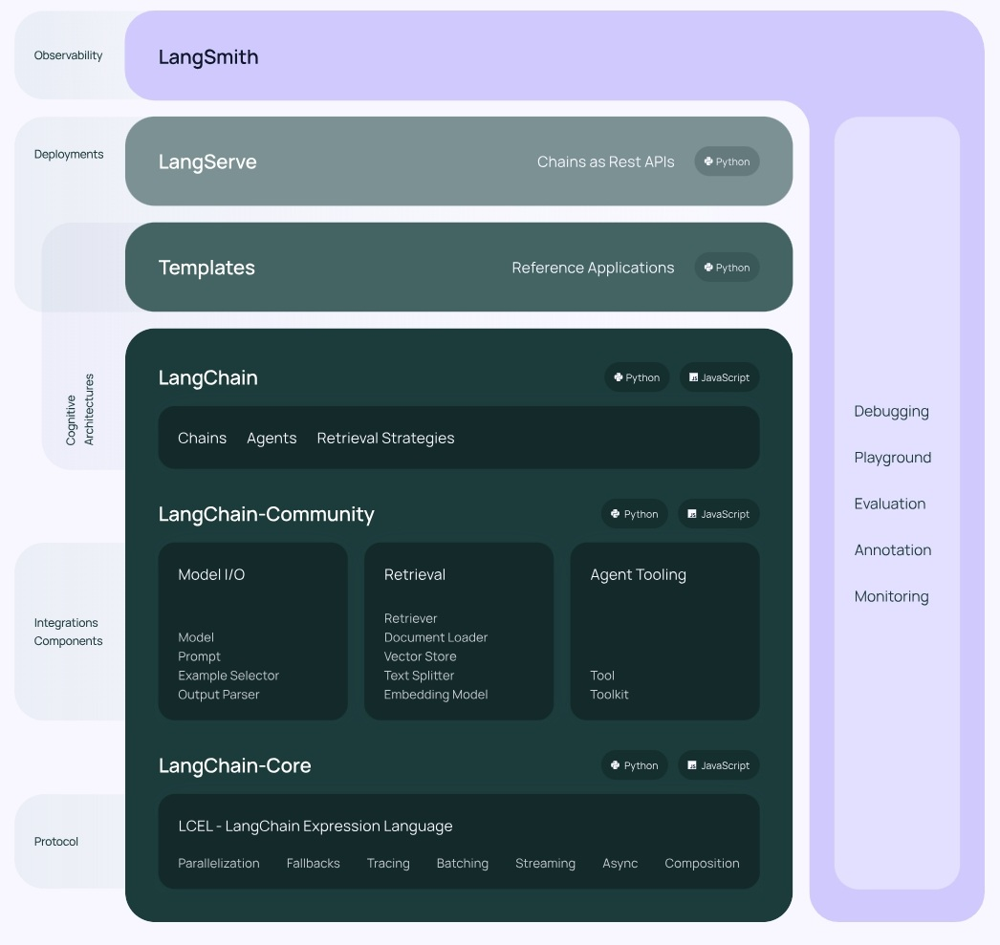
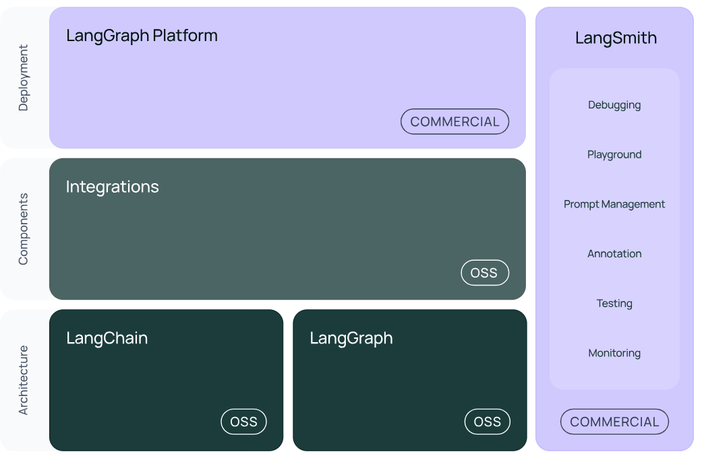

# v0.1版本

## V0.1结构：LangChain
**langchain**：构成应用程序认知架构的Chains，Agents，Retrieval strategies等
> 构成应⽤程序的链、智能体、RAG。

**langchain-community**：第三方集成
> ⽐如：Model I/O、Retrieval、Tool & Toolkit；合作伙伴包 langchain-openai，langchainanthropic等。

**langchain-Core**：基础抽象和LangChain表达式语言 (LCEL)
LangChain，就是AI应用组装套件，封装了一堆的API。langchain框架不大，但是里面琐碎的知识点特别多。就像玩乐高，提供了很多标准化的乐高零件（比如，连接器、轮子等）
# V0.2 / V0.3 版本

## LangGraph
LangGraph可以看做基于LangChain的api的进一步封装，能够协调多个Chain、Agent、Tools完成更复杂的任务，实现更高级的功能。
## LangSmith
https://docs.smith.langchain.com/

链路追踪。提供了6大功能，涉及Debugging (调试)、Playground (沙盒)、Prompt Management (提示管理)、Annotation (注释)、Testing (测试)、Monitoring (监控)等。与LangChain无缝集成，帮助从原型阶段过渡到生产阶段。
> 正是因为LangSmith这样的⼯具出现，才使得LangChain意义更⼤，要不仅靠⼀些API（当然也可以不⽤，⽤原⽣的API），⽀持不住LangChain的热度。
## LangServe
将LangChain的可运行项和链部署为REST API，使得它们可以通过网络进行调用。

## 总结
LangChain当中，最有前途的两个模块就是：**LangGraph，LangSmith**
LangChain能做RAG，其它的⼀些框架也能做，而且做的也不错，⽐如LlamaIndex。所以这时候LangChain要在Agent这块发⼒，那就需要LangGraph。而LangSmith，做运维、监控。故，⼆者是LangChain⾥最有前途的。