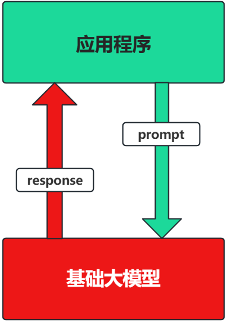
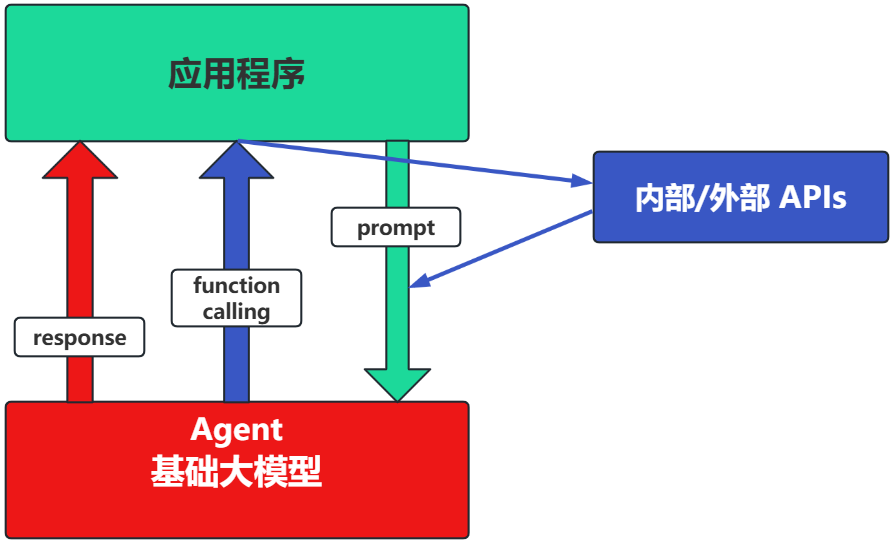
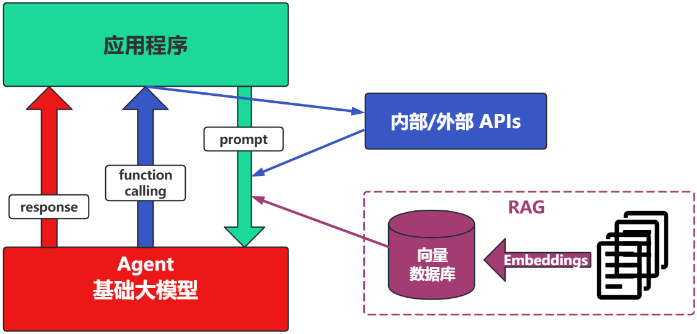
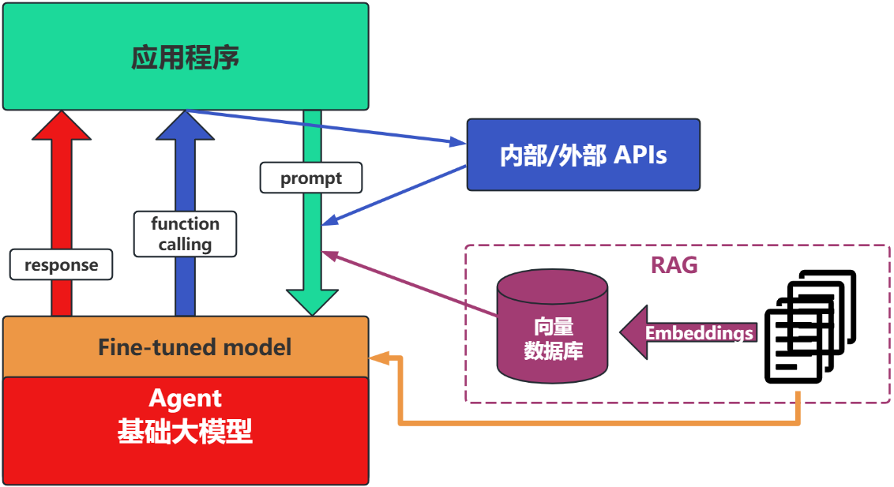
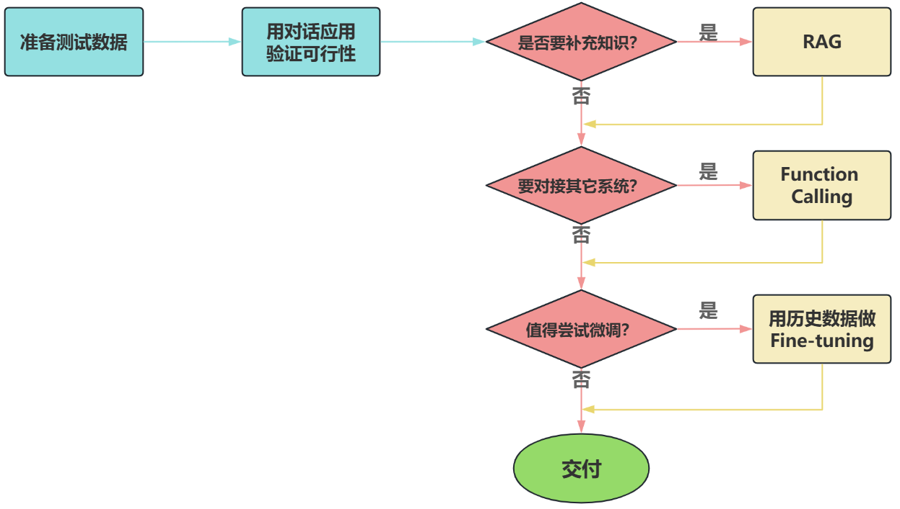

# 场景1：纯 Prompt
- Prompt是操作大模型的唯一接口
- 当人看：你说一句，ta回一句，你再说一句，ta再回一句...

# 场景2：Agent + Function Calling
- Agent：AI 主动提要求
- Function Calling：需要对接外部系统时，AI 要求执行某个函数
- 当人看：你问 ta「我明天去杭州出差，要带伞吗？」，ta 让你先看天气预报，你看了告诉ta，ta再告诉你要不要带伞

# 场景3：RAG (Retrieval-Augmented Generation)
RAG：需要补充领域知识时使用
- Embeddings：把文字转换为更易于相似度计算的编码。这种编码叫向量
- 向量数据库：把向量存起来，方便查找
- 向量搜索：根据输入向量，找到最相似的向量

# 场景4：Fine-tuning(精调/微调)

# 如何选择
