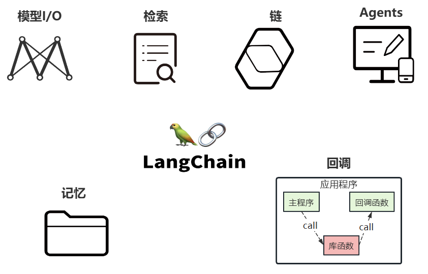

LangChain的核心组件涉及六大模块，这六大模块提供了一个全面且强大的框架，使开发者能够创建复杂、高效且用户友好的基于大模型的应用

# 核心组件的说明
## 核心组件1：Model I/O
> 这个模块使⽤最多，也最简单

Model I/O：标准化各个大模型的输入和输出，包含输入模版，模型本身和格式化输出。以下是使用语言模型从输入到输出的基本流程。

以下是对每一块的总结：
- **Format(格式化)** ：即指代Prompts Template，通过模板管理大模型的输入。将原始数据格式化成模型可以处理的形式，插入到一个模板问题中，然后送入模型进行处理。
- **Predict(预测)** ：即指代Models，使用通用接口调用不同的大语言模型。接受被送进来的问题，然后基于这个问题进行预测或生成回答。
- **Parse(生成)** ：即指代Output Parser 部分，用来从模型的推理中提取信息，并按照预先设定好的模版来规范化输出。比如，格式化成一个结构化的JSON对象。
## 核心组件2：Chains
Chain："链条"，用于将多个模块串联起来组成一个完整的流程，是 LangChain 框架中最重要的模块。
例如，一个 Chain 可能包括一个 Prompt 模板、一个语言模型和一个输出解析器，它们一起工作以处理
用户输入、生成响应并处理输出。
**常见的Chain类型：**
- LLMChain ：最基础的模型调用链
- SequentialChain ：多个链串联执行
- RouterChain ：自动分析用户的需求，引导到最适合的链
- RetrievalQA ：结合向量数据库进行问答的链
## 核心组件3：Memory

Memory：记忆模块，用于保存对话历史或上下文信息，以便在后续对话中使用。
**常见的 Memory 类型：**
- **ConversationBufferMemory** ：保存完整的对话历史
- **ConversationSummaryMemory** ：保存对话内容的精简摘要（适合长对话）
- **ConversationSummaryBufferMemory** ：混合型记忆机制，兼具上面两个类型的特点
- **VectorStoreRetrieverMemory** ：保存对话历史存储在向量数据库中
## 核心组件4：Agents

Agents，对应着智能体，是 LangChain 的高阶能力，它可以自主选择工具并规划执行步骤。
**Agent 的关键组成：**
- **AgentType** ：定义决策逻辑的工作流模式
- **Tool** ：是一些内置的功能模块，如API调用、搜索引擎、文本处理、数据查询等工具。Agents通过这些工具来执行特定的功能。
- **AgentExecutor** ：用来运行智能体并执行其决策的工具，负责协调智能体的决策和实际的工具执行。

## 核心组件5：Retrieval
Retrieval：对应着RAG，检索外部数据，然后在执行生成步骤时将其传递到 LLM。步骤包括文档加载、切割、Embedding等

- **Source ：数据源**，即大模型可以识别的多种类型的数据：视频、图片、文本、代码、文档等。
- **Load** ：负责将来自不同数据源的非结构化数据，加载为文档(Document)对象
- **Transform** ：负责对加载的文档进行转换和处理，比如将文本拆分为具有语义意义的小块。
- **Embed** ：将文本编码为向量的能力。一种用于嵌入文档，另一种用于嵌入查询
- **Store** ：将向量化后的数据进行存储
- **Retrieve** ：从大规模文本库中检索和查询相关的文本段落
## 核心组件6：Callbacks
Callbacks：回调机制，允许连接到 LLM 应用程序的各个阶段，可以监控和分析LangChain的运行情况，比如日志记录、监控、流传输等，以优化性能