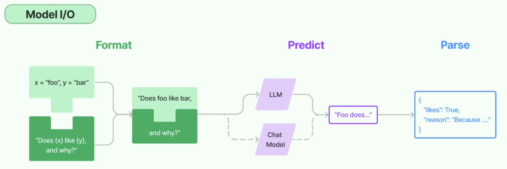
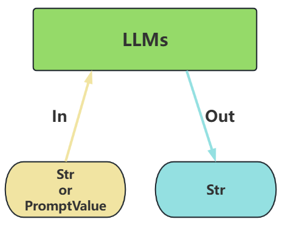
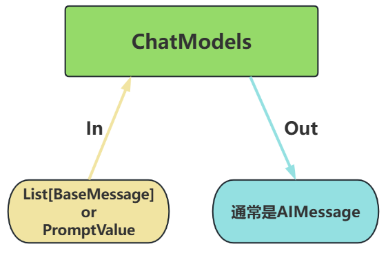
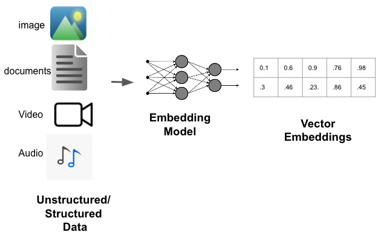

Model I/O 模块是与语言模型（LLMs）进行交互的 核心组件 ，在整个框架中有着很重要的地位。所谓的Model I/O，包括输入提示(Format)、调用模型(Predict)、输出解析(Parse)。分别对应着Prompt Template ， Model 和 Output Parser 。
> 简单来说，就是输⼊、模型处理、输出这三个步骤

LangChain作为一个“工具”，不提供任何 LLMs，而是依赖于第三方集成各种大模型。比如，将OpenAI、Anthropic、Hugging Face 、LlaMA、阿里Qwen、ChatGLM等平台的模型无缝接入到应用

# 模型的不同分类方式
1. 角度1：按照模型功能的不同：
	- 非对话模型（LLMs、Text Model）
	- 对话模型（Chat Models）（ 推荐 ）
	- 嵌入模型（Embedding Models）( 暂不考虑 )
2. 角度2：模型调用时，几个重要参数的书写位置的不同：
	- 硬编码：写在代码文件中使用环境变量
	- 使用配置文件（ 推荐 ）
3. 角度3：具体调用的API
	- OpenAI提供的API
	- 其它大模型自家提供的API
	- LangChain的统一方式调用API（ 推荐 ）
## 角度1出发：按照功能不同举例
### 类型1：LLMs(非对话模型)
LLMs，也叫Text Model、非对话模型，是许多语言模型应用程序的支柱。主要特点如下：
- **输入**：接受 **文本字符串** 或 **PromptValue** 对象
- **输出**：总是返回 **文本字符串**

- **适用场景**：仅需单次文本生成任务（如摘要生成、翻译、代码生成、单次问答）或对接
- **不支持消息结构的旧模型**（如部分本地部署模型）（ 言外之意，优先推荐ChatModel）
- **不支持多轮对话上下文**。每次调用独立处理输入，无法自动关联历史对话（需手动拼接历史文本）。
- **局限性**：无法处理角色分工或复杂对话逻辑
### 类型2: Chat Models(对话模型)
ChatModels，也叫聊天模型、对话模型，底层使用LLMs。大语言模型调用，以 ChatModel 为主！
主要特点如下：

- **输入**：接收消息列表 List[BaseMessage] 或 PromptValue ，每条消息需指定角色（**如SystemMessage**、**HumanMessage**、**AIMessage**）

- **输出**：总是返回带角色的 **消息对象 （ BaseMessage 子类）**，通常是 **AIMessage**

- **原生支持多轮对话**。通过消息列表维护上下文（例如： [SystemMessage, HumanMessage,AIMessage, ...] ），模型可基于完整对话历史生成回复。
- **适用场景**：对话系统（如客服机器人、长期交互的AI助手）
### Embedding Model(嵌入模型)
Embedding Model：也叫文本嵌入模型，这些模型将 文本 作为输入并返回 浮点数列表 ，也就是Embedding。

## 角度2出发：参数位置不同举例

### 模型调用的主要方法及参数
**相关方法及属性**

- **OpenAI(...) / ChatOpenAI(...)** ：创建一个模型对象（非对话类/对话类）
- **model.invoke(xxx)** ：执行调用，将用户输入发送给模型
- **.content** ：提取模型返回的实际文本内容
模型调用函数使用时需初始化模型，并设置必要的参数。
1) 必须设置的参数：
- **base_url** ：大模型 API 服务的根地址
- **api_key** ：用于身份验证的密钥，由大模型服务商（如 OpenAI、百度千帆）提供
- **model/model_name** ：指定要调用的具体大模型名称（如 gpt-4-turbo 、 ERNIE-3.5-8K 等）
2) 其它参数：
    - temperature ：温度，控制生成文本的“随机性”，取值范围为0～1。
        - 值越低 → 输出越确定、保守（适合事实回答）
        - 值越高 → 输出越多样、有创意（适合创意写作）
    通常，根据需要设置如下：
        - **精确模式**（0.5或更低）：生成的文本更加安全可靠，但可能缺乏创意和多样性。
        - **平衡模式**（通常是0.8）：生成的文本通常既有一定的多样性，又能保持较好的连贯性和性。
        - **创意模式**（通常是1）：生成的文本更有创意，但也更容易出现语法错误或不合逻辑的内容。
        - **max_tokens** ：限制生成文本的最大长度，防止输出过长。
    **Token是什么？**
	    **基本单位** : 大模型处理文本的最小单位是token（相当于自然语言中的词或字），输出时逐个token依次生成。
        收费依据 ：大语言模型(LLM)通常也是以token的数量作为其计量(或收费)的依据。
	        - 1个Token≈1-1.8个汉字，1个Token≈3-4个英文字母
	        - Token与字符转化的可视化工具：
		        - OpenAI提供：https://platform.openai.com/tokenizer
		        - 百度智能云提供：https://console.bce.baidu.com/support/#/tokenizer
		max_tokens设置建议：
		- 客服短回复：128-256。比如：生成一句客服回复（如“订单已发货，预计明天送达”）
		- 常规对话、多轮对话：512-1024
		- 长内容生成：1024-4096。比如：生成一篇产品说明书（包含功能、使用方法等结构）

