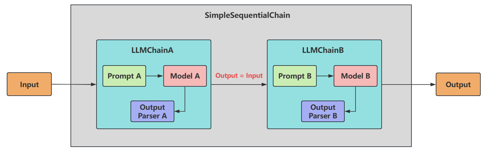
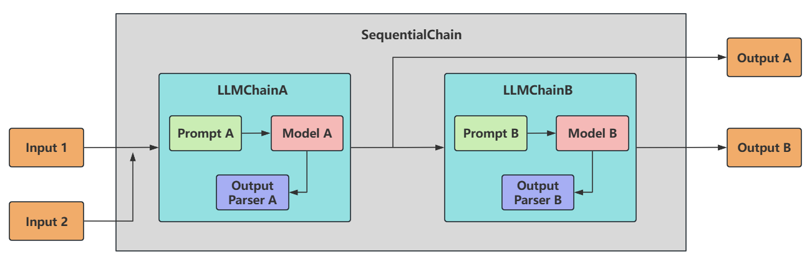
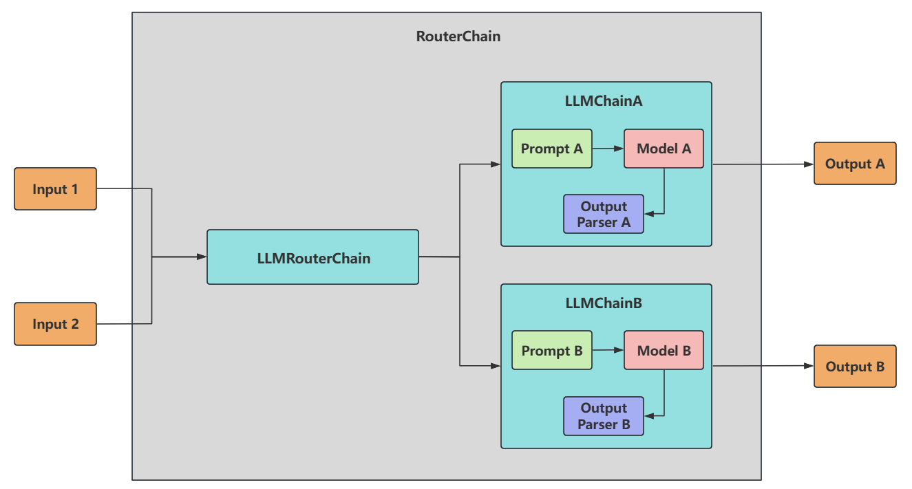

# 基础链：LLMChain

LCEL之前，最基础也最常见的链类型是LLMChain。

这个链至少包括一个提示词模板（PromptTemplate），一个语言模型（LLM 或聊天模型）。
特点：
- 用于 **单次问答**，输入一个 Prompt，输出 LLM 的响应。
- 适合 **无上下文** 的简单任务（如翻译、摘要、分类等）。
- 无记忆：无法自动维护聊天历史
主要步骤：
 1. 配置任务链：使用LLMChain类将任务与提示词结合，形成完整的任务链。
 2. 执行任务链：使用invoke()等方法执行任务链，并获取生成结果。可以根据需要对输出进行处理和展示。

```ts
import { ChatOpenAI } from "@langchain/openai";
import { PromptTemplate } from "@langchain/core/prompts";
import { LLMChain } from "langchain/chains";

const model = new ChatOpenAI({
  modelName: "gpt-4o-mini", 
  temperature: 0,
});

const prompt = PromptTemplate.fromTemplate(
  "请把下面这句话翻译成中文：{text}"
);

const chain = new LLMChain({ llm: model, prompt });

const res = await chain.invoke({ text: "LangChain makes LLM apps easy." });
console.log(res.text);
```

> 注意：`LLMChain` 在新版本中已被标记为 **legacy**，官方推荐用 LCEL 写法 `prompt.pipe(model)`，效果等价但更灵活。这里仅作为"传统链"概念演示。
# 顺序链：SimpleSequentialChain
顺序链（SequentialChain）允许将多个链顺序连接起来，每个Chain的输出作为下一个Chain的输入，形成特定场景的流水线（Pipeline）。
 **顺序链有两种类型**：
 - 单个输入/输出：对应着 SimpleSequentialChain
 - 多个输入/输出：对应着：SequentialChain



**例子**：先根据产品名生成一段中文营销描述，再把它翻译成英文。

```ts
import { ChatOpenAI } from "@langchain/openai";
import { PromptTemplate } from "@langchain/core/prompts";
import { LLMChain, SimpleSequentialChain } from "langchain/chains";

const model = new ChatOpenAI({ modelName: "gpt-4o-mini", temperature: 0.7 });

const chain1 = new LLMChain({
  llm: model,
  prompt: PromptTemplate.fromTemplate(
    "请为产品「{product}」写一段 30 字以内的中文营销描述。"
  ),
});

const chain2 = new LLMChain({
  llm: model,
  prompt: PromptTemplate.fromTemplate(
    "把下面这段中文翻译成英文：\n{text}"
  ),
});

const overall = new SimpleSequentialChain({
  chains: [chain1, chain2],
  verbose: true,
});

const result = await overall.invoke({ input: "智能保温杯" });
console.log(result.output);
```

执行流程：
1. `chain1` 收到 `"智能保温杯"` → 输出中文描述（如 *"24小时恒温，告别凉茶水……"*）
2. `chain2` 自动接收上一步的输出 → 翻译成英文 → 作为最终结果

> 限制：`SimpleSequentialChain` 只能传**单一字符串**，无法在中途引用前几步的中间产物或外部变量；如果需要多输入多输出，得用下面的 `SequentialChain`。

# 顺序链：SequentialChain
- **多变量支持** ：允许不同子链有独立的输入/输出变量。
- **灵活映射** ：需 显式定义 变量如何从一个链传递到下一个链。即精准地命名输入关键字和输出关键字，来明确链之间的关系。
- **复杂流程控制** ：支持分支、条件逻辑（分别通过 input_variables 和 output_variables 配置输入和输出）



**例子**：输入产品名 + 目标用户 → 先生成营销描述 → 再基于描述生成一句广告 slogan，最终同时拿到两个结果。

```ts
import { ChatOpenAI } from "@langchain/openai";
import { PromptTemplate } from "@langchain/core/prompts";
import { LLMChain, SequentialChain } from "langchain/chains";

const model = new ChatOpenAI({ modelName: "gpt-4o-mini", temperature: 0.7 });

const descChain = new LLMChain({
  llm: model,
  prompt: PromptTemplate.fromTemplate(
    "请为产品「{product}」面向「{audience}」写一段 50 字以内的中文营销描述。"
  ),
  outputKey: "description",
});

const sloganChain = new LLMChain({
  llm: model,
  prompt: PromptTemplate.fromTemplate(
    "基于以下描述，提炼一句 10 字以内的广告 slogan：\n{description}"
  ),
  outputKey: "slogan",
});

const overall = new SequentialChain({
  chains: [descChain, sloganChain],
  inputVariables: ["product", "audience"],
  outputVariables: ["description", "slogan"],
  verbose: true,
});

const result = await overall.invoke({
  product: "智能保温杯",
  audience: "户外运动爱好者",
});

console.log(result.description);
console.log(result.slogan);
```

执行流程：
1. `descChain` 收到 `{ product, audience }` → 输出写入 `description`。
2. `sloganChain` 的模板里写 `{description}`，自动从上下文取值 → 输出写入 `slogan`。
3. `SequentialChain` 最终把 `outputVariables` 里声明的字段都返回。

**对比 `SimpleSequentialChain`**：

| 维度 | SimpleSequentialChain | SequentialChain |
| --- | --- | --- |
| 输入 | 单字符串（`input`） | 多变量字典 |
| 链间传递 | 上一步输出 → 下一步唯一输入 | 任意命名变量，按 key 引用 |
| 最终输出 | 单字符串（`output`） | 多个命名字段 |
| 适用 | 简单串联（翻译、改写） | 多步骤、多变量的真实业务流 |

# 路由链 RouterChain
路由链（RouterChain）用于创建可以 动态选择下一条链 的链。可以自动分析用户的需求，然后引导到最适合的链中执行，获取响应并返回最终结果。



**核心机制**：
1. 准备多条**目标链**（每条擅长一个领域），并为每条写一段"描述"。
2. 用一个 LLM 充当**路由器**，读取用户输入 + 各链描述，决定走哪条链。
3. 选不到合适的就走**默认链**兜底。

**例子**：根据用户问题自动路由到"物理老师 / 数学老师"，其它问题走默认链。

```ts
import { ChatOpenAI } from "@langchain/openai";
import { MultiPromptChain } from "langchain/chains";

const model = new ChatOpenAI({ modelName: "gpt-4o-mini", temperature: 0 });

const promptInfos = [
  {
    name: "physics",
    description: "适合回答物理相关的问题",
    promptTemplate: "你是一位物理专家，请用通俗的语言回答：\n{input}",
  },
  {
    name: "math",
    description: "适合回答数学相关的问题",
    promptTemplate: "你是一位数学专家，请一步步推理后回答：\n{input}",
  },
];

const chain = MultiPromptChain.fromLLMAndPrompts(model, {
  promptNames: promptInfos.map((p) => p.name),
  promptDescriptions: promptInfos.map((p) => p.description),
  promptTemplates: promptInfos.map((p) => p.promptTemplate),
});

console.log(await chain.invoke({ input: "什么是黑体辐射？" }));
console.log(await chain.invoke({ input: "求 17 的平方根，保留两位小数" }));
console.log(await chain.invoke({ input: "今天天气怎么样？" })); // 走默认链
```

执行流程：
1. 路由器 LLM 看到 `"什么是黑体辐射"` → 匹配描述 → 选 `physics` 链。
2. 路由器把输入交给被选中的链，由它生成最终回答。
3. 命中不了任何描述时，自动 fallback 到 `defaultChain`（`MultiPromptChain` 内部默认提供）。

**与前面几种链的对比**：

| 链类型 | 控制流 | 适用 |
| --- | --- | --- |
| `LLMChain` | 单步 | 单一任务 |
| `SimpleSequentialChain` | 固定串联 | 简单流水线 |
| `SequentialChain` | 固定串联（多变量） | 复杂流水线 |
| `RouterChain` / `MultiPromptChain` | **动态分支** | 根据输入决定走哪条链 |

> 注意：`MultiPromptChain` 同样属于 legacy。LCEL 写法用 `RunnableBranch` 或 `RunnableLambda` 实现路由，更灵活；这里仅作传统链概念演示。