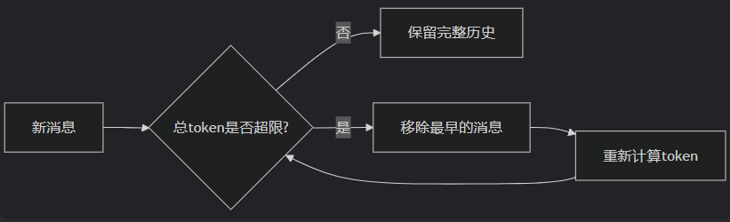
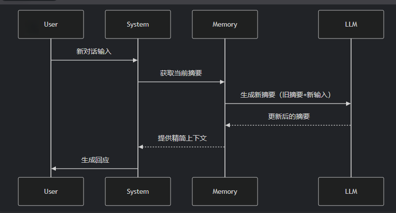
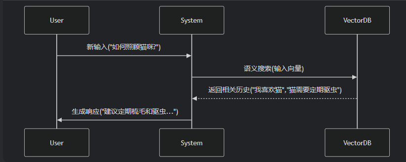

### ConversationTokenBufferMemory
ConversationTokenBufferMemory 是 LangChain 中一种基于 **Token 数量控制** 的对话记忆机制。如果字符数量超出指定数目，它会切掉这个对话的早期部分，以保留与最近的交流相对应的字符数量

**特点：**
- Token 精准控制
- 原始对话保留



**关键参数**：
- `maxTokenLimit`：历史保留的 token 数上限，**超过就从最早的消息开始裁掉**。
- `llm`：必须传，**仅用于 token 计数**（不同模型分词器不同，这里不会真的调模型生成）。

```ts
import { ChatOpenAI } from "@langchain/openai";
import { ConversationTokenBufferMemory } from "langchain/memory";

const llm = new ChatOpenAI({ modelName: "gpt-4o-mini" });

const memory = new ConversationTokenBufferMemory({
  llm,                              // 仅用作 tokenizer
  maxTokenLimit: 30,                // 故意设小，演示截断
  returnMessages: false,
});

await memory.saveContext({ input: "我叫小明" },        { output: "你好小明" });
await memory.saveContext({ input: "我今年 18 岁" },     { output: "记住了" });
await memory.saveContext({ input: "我喜欢 TypeScript" }, { output: "TS 类型很棒" });

console.log(await memory.loadMemoryVariables({}));
// { history: 'Human: 我喜欢 TypeScript\nAI: TS 类型很棒' }
//   ↑ 累计 token 超过 30 后，最早的两轮被自动丢弃
```

要点：
- 它**不会切半句话**，按"消息"为粒度从头丢，直到剩下的总 token ≤ `maxTokenLimit`。
- 适合对成本敏感、可以接受"忘掉早期内容"的生产场景。

### ConversationSummaryMemory
> 前⾯的⽅式发现，如果全部保存下来太过浪费，截断时⽆论是按照 对话条数 还是 token 都是⽆法保证既节省内存⼜保证对话质量的，所以推出ConversationSummaryMemory、ConversationSummaryBufferMemory

ConversationSummaryMemory是 LangChain 中一种 **智能压缩对话历史** 的记忆机制，它通过大语言模型(LLM)自动生成对话内容的 **精简摘要** ，而不是存储原始对话文本。这种记忆方式特别适合长对话和需要保留核心信息的场景。
**特点：**
- 摘要生成
- 动态更新
- 上下文优化



**关键参数**：
- `llm`：用来**生成摘要**（每次 `saveContext` 都会调用一次 LLM 把"旧摘要 + 新对话"压成新摘要）。
- 默认摘要 prompt 是英文的，中文场景建议自定义 `prompt`。

```ts
import { ChatOpenAI } from "@langchain/openai";
import { ConversationSummaryMemory } from "langchain/memory";
import { PromptTemplate } from "@langchain/core/prompts";

const llm = new ChatOpenAI({ modelName: "gpt-4o-mini", temperature: 0 });

const summaryPrompt = PromptTemplate.fromTemplate(
  `请用中文，把"已有摘要 + 新对话"合并成一段简洁的新摘要。
已有摘要：{summary}
新对话：
{new_lines}
新摘要：`
);

const memory = new ConversationSummaryMemory({
  llm,
  prompt: summaryPrompt,
  memoryKey: "history",
  returnMessages: false,
});

await memory.saveContext({ input: "我叫小明" },        { output: "你好小明" });
await memory.saveContext({ input: "我今年 18 岁" },     { output: "记住了，18 岁" });
await memory.saveContext({ input: "我喜欢编程，主要写 TypeScript" }, { output: "TS 是很好的选择" });

console.log(await memory.loadMemoryVariables({}));
// { history: '小明今年 18 岁，喜欢编程，主要使用 TypeScript，AI 表示认可。' }
//   ↑ 不是原文，而是一段被 LLM 压缩过的摘要
```

要点：
- 历史**永远是一段摘要文本**，token 不会随轮数线性增长。
- 代价：每轮多一次 LLM 调用；摘要会损失细节（比如具体的代码、数字可能被糊掉）。
- 折中方案是 `ConversationSummaryBufferMemory`：**最近 k 轮保留原文 + 更早的内容自动摘要**，兼顾近期细节和远期压缩。

### ConversationSummaryBufferMemory

ConversationSummaryBufferMemory 是 LangChain 中一种**混合型记忆机制**，它结合了ConversationBufferMemory（完整对话记录）和 ConversationSummaryMemory（摘要记忆）的优点，在**保留最近 对话原始记录** 的同时，对较早的对话内容进行 **智能摘要**

**工作机制一句话**：维护一个"近期原文 buffer"，超过 `maxTokenLimit` 时把最早的几条挤出去喂给 LLM，跟旧摘要合并成新摘要。最终历史结构永远是：

```
[ 累积摘要 ] + [ 最近若干轮原文 ]
```

**关键参数**：
- `llm`：双用途——既用来**生成摘要**，也用来**计 token**。
- `maxTokenLimit`：buffer 的容量上限。超过就触发摘要。

```ts
import { ChatOpenAI } from "@langchain/openai";
import { ConversationSummaryBufferMemory } from "langchain/memory";

const llm = new ChatOpenAI({ modelName: "gpt-4o-mini", temperature: 0 });

const memory = new ConversationSummaryBufferMemory({
  llm,
  maxTokenLimit: 40,                  // 故意设小，方便看到"远期摘要 + 近期原文"
  returnMessages: false,
});

await memory.saveContext({ input: "我叫小明" },                  { output: "你好小明" });
await memory.saveContext({ input: "我今年 18 岁" },               { output: "记住了" });
await memory.saveContext({ input: "我喜欢编程，主要写 TypeScript" }, { output: "TS 是不错的选择" });
await memory.saveContext({ input: "我目前住在北京" },              { output: "北京是个好地方" });

console.log(await memory.loadMemoryVariables({}));
// {
//   history:
//     'System: 小明 18 岁，喜欢编程，主要使用 TypeScript。\n' + // ← 早期被压成摘要
//     'Human: 我目前住在北京\n' +                                 // ← 最近原文
//     'AI: 北京是个好地方'
// }
```

要点：
- 早期"我叫小明 / 18 岁 / 喜欢编程"被合并到一段摘要里（以 `System` 消息形式存在）。
- 最近一轮"我住在北京"还是**原文**，细节没丢。
- 只有 buffer 真的超出 `maxTokenLimit` 时才会调用 LLM 做摘要——大多数轮次零额外成本。

**和纯 SummaryMemory 的对比**：

| 维度 | SummaryMemory | SummaryBufferMemory |
| --- | --- | --- |
| 历史构成 | 全部摘要 | 摘要 + 近期原文 |
| 近期细节 | 会糊 | 保留 |
| LLM 调用频率 | 每轮 | 仅 buffer 溢出时 |
| 默认推荐度 | 一般 | **生产推荐** |

> 这也是为什么前面的对比表把它列为"综合最优"——它在 token 预算、信息完整度、调用成本三方面取得了最好的折中。

**三种长会话方案对比**：

| 方案 | 早期信息 | token 控制 | 额外成本 | 适用 |
| --- | --- | --- | --- | --- |
| `BufferWindowMemory` | 直接丢 | 按轮数 | 无 | 只关心最近几轮 |
| `ConversationTokenBufferMemory` | 直接丢 | 按 token 精准 | 无 | 严格 token 预算 |
| `ConversationSummaryMemory` | 压成摘要 | 摘要长度 | 每轮 +1 次 LLM | 长会话需保留主线 |
| `ConversationSummaryBufferMemory` | 远期摘要 + 近期原文 | token + 摘要 | 触发摘要时 +1 次 LLM | 综合最优，生产推荐 |


### ConversationEntityMemory
ConversationEntityMemory 是一种基于实体的对话记忆机制，它能够智能地识别、存储和利用对话中出现的实体信息（如人名、地点、产品等）及其属性/关系，并结构化存储，使 AI 具备更强的上下文理解和记忆能力。
好处：解决信息过载问题
- 长对话中大量冗余信息会干扰关键事实记忆
- 通过对实体摘要，可以压缩非重要细节（如删除寒暄等，保留价格/时间等硬性事实）
**应用场景**：在医疗等高风险领域，必须用实体记忆确保关键信息（如过敏史）被100%准确识别和拦截。

**工作机制**：
1. 每次 `saveContext` 时，让 LLM 从对话中**抽取实体**（人名、地点、组织等）。
2. 对每个实体，再让 LLM 维护一段"关于该实体的所有事实"（kv 存储：`{entityName: 描述}`）。
3. `loadMemoryVariables({ input })` 时，根据**当前输入**先抽出涉及的实体，再返回这些实体的累计信息。

```ts
import { ChatOpenAI } from "@langchain/openai";
import { EntityMemory } from "langchain/memory";

const llm = new ChatOpenAI({ modelName: "gpt-4o-mini", temperature: 0 });

const memory = new EntityMemory({
  llm,
  chatHistoryKey: "history",   // 对话原文 key
  entitiesKey: "entities",     // 实体信息 key
});

await memory.saveContext(
  { input: "小明是一名 18 岁的程序员，住在北京，喜欢用 TypeScript" },
  { output: "了解了" },
);
await memory.saveContext(
  { input: "小明刚加入了字节跳动" },
  { output: "恭喜小明" },
);

console.log(await memory.loadMemoryVariables({ input: "小明现在在哪工作？" }));
// {
//   history: 'Human: ...\nAI: ...',
//   entities: { 小明: '一名 18 岁的程序员，住在北京，使用 TypeScript，刚加入字节跳动。' }
// }
```

要点：
- 实体存储是 **kv 结构**，可跨多轮对话累计同一实体的所有事实。
- prompt 模板里同时引用 `{history}` 和 `{entities}`，把实体描述显式注入。
- 代价：每轮要额外调用 LLM 做实体抽取和摘要更新。

**对比 SummaryMemory vs EntityMemory**：

| 维度 | SummaryMemory | EntityMemory |
| --- | --- | --- |
| 压缩单位 | 整段对话 | 每个实体独立 |
| 结构 | 一段文本 | kv 字典 |
| 检索方式 | 全部注入 | 按当前输入相关实体筛选注入 |
| 适用 | 主线剧情/上下文延续 | 角色卡、用户画像、关键事实留存 |

### ConversationKGMemory

ConversationKGMemory是一种基于知识图谱（Knowledge Graph）的对话记忆模块，它比ConversationEntityMemory 更进一步，不仅能识别和存储实体，还能捕捉实体之间的复杂关系，形成结构化的知识网络

特点：
- 知识图谱结构 将对话内容转化为 (头实体, 关系, 尾实体) 的三元组形式
- 动态关系推理

**工作机制**：每次 `saveContext` 时让 LLM 把对话抽成一组三元组 `(subject, predicate, object)`，存进图谱；查询时根据当前输入涉及的实体，反查图谱里的相关三元组。

```ts
import { ChatOpenAI } from "@langchain/openai";
import { ConversationKGMemory } from "langchain/memory";

const llm = new ChatOpenAI({ modelName: "gpt-4o-mini", temperature: 0 });

const memory = new ConversationKGMemory({
  llm,
  memoryKey: "history",
  returnMessages: false,
});

await memory.saveContext(
  { input: "小明在字节跳动工作，他的同事是小红" },
  { output: "明白" },
);

console.log(await memory.loadMemoryVariables({ input: "小红是谁？" }));
// {
//   history: '关于 小红 的相关知识：\n- 小红 是 小明 的 同事'
// }
//   ↑ 内部存为三元组 (小明, 工作于, 字节跳动) / (小明, 同事, 小红)
//     查询时根据"小红"反向找到关联三元组返回
```

要点：
- 比 EntityMemory 更结构化——知道"实体之间怎么关联"，而不只是各自的属性。
- 可以做简单的**关系推理**（A 是 B 的同事 + B 在 X 公司 → A 可能也在 X）。
- 代价更高：每轮要做两次 LLM 调用（抽三元组 + 查询时筛选）。

### VectorStoreRetrieverMemory
VectorStoreRetrieverMemory是一种基于 向量检索 的先进记忆机制，它将对话历史存储在向量数据库中，通过 语义相似度检索 相关信息，而非传统的线性记忆方式。每次调用时，就会查找与该记忆关联最高的k个文档。

**适用场景**：这种记忆特别适合需要长期记忆和语义理解的复杂对话系统。



**工作机制**：
1. `saveContext` 时把对话片段 embedding 后存入向量库。
2. `loadMemoryVariables({ input })` 时，对当前输入做 embedding，到向量库里查 **top-k 最相似**的历史片段返回。
3. 注入 prompt 的不是"全部历史"，而是"和当前问题语义最相关的几条"。

```ts
import { ChatOpenAI, OpenAIEmbeddings } from "@langchain/openai";
import { MemoryVectorStore } from "langchain/vectorstores/memory";
import { VectorStoreRetrieverMemory } from "langchain/memory";

const vectorStore = new MemoryVectorStore(new OpenAIEmbeddings());
const retriever = vectorStore.asRetriever(2);    // 每次取 top-2

const memory = new VectorStoreRetrieverMemory({
  vectorStoreRetriever: retriever,
  memoryKey: "history",
});

await memory.saveContext({ input: "我喜欢 TypeScript" },     { output: "TS 类型很棒" });
await memory.saveContext({ input: "我家的猫叫小白" },         { output: "可爱的名字" });
await memory.saveContext({ input: "我今天吃了红烧牛肉面" },   { output: "听起来不错" });
await memory.saveContext({ input: "周末要去爬山" },           { output: "注意安全" });

console.log(await memory.loadMemoryVariables({ input: "我家的宠物" }));
// { history: 'input: 我家的猫叫小白\noutput: 可爱的名字' }
//   ↑ 只返回"猫"相关那条，其它不相关的不会注入
```

要点：
- 容量近乎**无限**——所有历史都进向量库，只在用时取最相关的几条。
- 注入到 prompt 的内容**与当前问题强相关**，避免无关历史占用 token。
- 代价：每条消息都要 embedding，每轮还要一次向量查询；需要外部向量数据库支持。

**所有 Memory 类型总览**：

| 类型 | 核心思想 | 信息丢失 | LLM 额外调用 | 典型场景 |
| --- | --- | --- | --- | --- |
| `BufferMemory` | 全量保存 | 无 | 无 | 短会话 |
| `BufferWindowMemory` | 最近 K 轮 | 早期丢 | 无 | 滑动窗口 |
| `TokenBufferMemory` | Token 截断 | 早期丢 | 无 | 严格 token 预算 |
| `SummaryMemory` | 全量摘要 | 细节糊 | 每轮 1 次 | 长会话保主线 |
| `SummaryBufferMemory` | 远期摘要+近期原文 | 远期细节糊 | 触发时 1 次 | 生产推荐 |
| `EntityMemory` | 实体 kv | 非实体内容丢 | 每轮 2 次 | 角色卡/用户画像 |
| `KGMemory` | 知识图谱 | 三元组之外丢 | 每轮 2 次 | 关系推理 |
| `VectorStoreRetrieverMemory` | 语义检索 | 不丢，但只取 top-k | 每轮 1 次检索 | 海量长期记忆 |

---

### 实战案例：Yoren-Lee-Server 的双层记忆架构

agent-server 没有直接用上面任何一个 LangChain Memory 类，而是**手动组合实现了一套双层记忆**，思路非常值得对照学习。

#### 整体架构

```
┌──────────── 短期记忆（自动注入 prompt） ────────────┐
│  SessionService                                  │
│  ├─ Redis 缓存（最近 20 条，TTL 1 小时）           │
│  └─ PostgreSQL 持久化（Prisma message 表）        │
│       ↓ 每次对话先读 Redis，未命中读 DB 并回填     │
└───────────────────────────────────────────────────┘
                       ↓
                AgentService.stream()
                       ↓
┌──────────── 长期记忆（按需检索） ──────────────────┐
│  VectorDBService（Upstash Vector，BGE-M3 embed）  │
│  ├─ type=conversation   对话摘要                  │
│  ├─ type=chapter_summary 章节摘要                 │
│  ├─ type=event          剧情事件                  │
│  └─ type=character_memory 人物记忆                │
│       ↑ 通过 agent tool（search_plot_memory）     │
│         由 LLM 主动决定何时检索                    │
└───────────────────────────────────────────────────┘
```

#### 关键设计点

1. **短期记忆 ≈ BufferWindowMemory + Redis 持久化**
   - `RECENT_MSG_LIMIT = 20` —— 滑动窗口 K=20。
   - Redis 提供秒级读写，DB 兜底持久化，TTL 1 小时自动清理。
   - 每轮 `chatStream` 流程：读最近 20 条 → 拼进 `currentMessages` → 流式调 LLM → 异步写回 DB + Redis。

2. **长期记忆 ≈ VectorStoreRetrieverMemory，但用 Agent Tool 触发**
   - 这是和传统 LangChain Memory 最大的区别：**不自动注入**，而是包装成 `search_plot_memory` 工具，让 LLM 在需要回忆剧情时**自主调用**。
   - 好处：避免每轮都把无关历史塞进上下文；LLM 自己判断"这次问题需不需要查历史"，token 利用率更高。

3. **多类型记忆通过 metadata.type 区分**
   - `conversation` / `chapter_summary` / `event` / `character_memory` 共用同一个 Upstash Vector 索引。
   - 检索时通过 `filter: "novelId = X AND type = 'event'"` 精确过滤——这是**手写版 EntityMemory + KGMemory**，但用结构化 metadata 替代 LLM 抽取，更可控、更便宜。

4. **写入时机分离**
   - 短期记忆：流结束**立即**写 DB + Redis（同步）。
   - 长期记忆：流结束后**异步** `storeToVectorMemory`（fire-and-forget），不阻塞响应。

#### 与 LangChain Memory 的对照表

| Yoren-Lee-Server 实现 | 等价的 LangChain Memory | 关键改进 |
| --- | --- | --- |
| `SessionService.getRecentMessages` (K=20 + Redis) | `BufferWindowMemory` | 加了 Redis 缓存 + DB 持久化 |
| `VectorDBService` + `storeToVectorMemory` | `VectorStoreRetrieverMemory` | 用 Upstash 自带 embedding，省掉 OpenAIEmbeddings |
| `search_plot_memory` 工具 | 没有现成对应 | **从"自动注入"改成"LLM 按需调用"**，更接近 Agent 范式 |
| `query_character` tool + Prisma | `EntityMemory` | 用关系数据库存实体，比 LLM 抽取更稳定 |
| `get_writing_style` tool | 无 | 风格也作为一种"长期记忆"管理 |

#### 设计哲学

> **短期记忆"被动注入"，长期记忆"主动检索"。**

- 短期上下文必须有，所以**自动**喂进每次 prompt。
- 长期记忆量大、不一定相关，所以做成**工具**让 LLM 自己决定要不要查——这是 LangChain Memory 模块进化到 **Agent + Tools** 范式的体现。这套思路已经超越了传统 Memory，更接近 LangGraph / 自治 Agent 的现代写法。