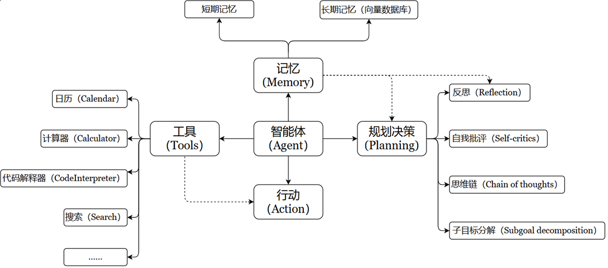

Tools 用于扩展大语言模型（LLM）的能力，使其能够与外部系统、API 或自定义函数交互，从而完成仅靠文本生成无法实现的任务（如搜索、计算、数据库查询等）。


**特点：**
- **增强 LLM 的功能** ：让 LLM 突破纯文本生成的限制，执行实际操作（如调用搜索引擎、查询数据库、运行代码等）
- **支持智能决策** ：在Agent 工作流中，LLM 根据用户输入动态选择最合适的 Tool 完成任务。
- 模块化设计 ：每个 Tool 专注一个功能，便于复用和组合（例如：搜索工具 + 计算工具 + 天气查询工具）

## Tool 的要素
Tools 本质上是封装了特定功能的可调用模块，是Agent、Chain或LLM可以用来与世界互动的接口
Tool 通常包含如下几个要素：
- **name** ：工具的名称
- **description** ：工具的功能描述
- 该工具输入的 **JSON模式**
- 要调用的函数
- **return_direct** ：是否应将工具结果直接返回给用户（仅对Agent相关）
实操步骤：
- 步骤1：将name、description 和 JSON模式作为上下文提供给LLM
- 步骤2：LLM会根据提示词推断出 需要调用哪些工具 ，并提供具体的调用参数信息
- 步骤3：用户需要根据返回的工具调用信息，自行触发相关工具的回调

## 自定义工具
**第1种**：使用@tool装饰器（自定义工具的最简单方式）

装饰器默认使用函数名称作为工具名称，但可以通过参数 name_or_callable 来覆盖此设置。

同时，装饰器将使用函数的 文档字符串 作为 工具的描述 ，因此函数必须提供文档字符串。

**第2种**：使用StructuredTool.from_function类方法

这类似于 @tool 装饰器，但允许更多配置和同步/异步实现的规范。

## LangChain.js 中的实现：DynamicStructuredTool

在 Node/TS 项目中（如 `agent-server`），常用 `@langchain/core/tools` 提供的 `DynamicStructuredTool`，配合 `zod` 来声明输入 Schema。它与 Python 端 `StructuredTool.from_function` 是同构的——都是"包一层 + 给 LLM 看的元信息 + 实际执行函数"。

Tool 五要素到 TS 字段的映射：

| 要素 | TS 字段 | 说明 |
| --- | --- | --- |
| name | `name` | 工具名，LLM 通过它来调用 |
| description | `description` | 工具用途描述，**写得越准 LLM 调用越准** |
| JSON 模式 | `schema`（zod） | LangChain 会把 zod schema 转成 JSON Schema 喂给 LLM |
| 调用函数 | `func` | 实际执行体，参数已被 zod 校验 |
| return_direct | `returnDirect` | 是否跳过 LLM 直接返回结果给用户（默认 false） |

最小骨架：

```typescript
import { DynamicStructuredTool } from '@langchain/core/tools';
import { z } from 'zod';

new DynamicStructuredTool({
  name: 'tool_name',
  description: '何时该调用我、我能解决什么',
  schema: z.object({
    query: z.string().describe('参数说明，会注入到 JSON Schema'),
  }),
  func: async ({ query }) => {
    return '返回给 LLM 的字符串';
  },
});
```

> 经验：`description` 与 `z.xxx().describe(...)` 是 **唯一让 LLM 理解工具的入口**，注释要面向 LLM 写，不是面向人写。

## 实战：三类典型工具的设计

`agent-server/src/agent/tools` 下三个工具刚好对应三种工程范式：

### 1. 向量检索类——`search_plot_memory`

用于"模糊召回"，参数是自然语言 query，返回 topK 相关片段。

```typescript
new DynamicStructuredTool({
  name: 'search_plot_memory',
  description: '根据语义检索小说的剧情记忆... 当需要回忆之前的剧情发展时使用。',
  schema: z.object({
    query: z.string().describe('检索关键词或描述，如"主角第一次遇到反派"'),
    novelId: z.number().describe('小说 ID'),
    topK: z.number().optional().default(5),
  }),
  func: async ({ query, novelId, topK }) => {
    const results = await vectorDB.query(query, {
      topK,
      filter: `novelId = ${novelId}`,
      includeMetadata: true,
    });
    return results.map((r, i) =>
      `[${i + 1}] (相似度: ${(r.score * 100).toFixed(1)}%) ${r.metadata?.content ?? ''}`
    ).join('\n\n');
  },
});
```

设计要点：
- 返回值用 **格式化字符串**（带序号、相似度、元数据），比直接返回 JSON 对 LLM 更友好；
- 空结果返回明确提示语，避免 LLM 误以为"工具坏了"。

### 2. 关系库列表查询类——`query_character`

用于按条件查多条记录，参数可选，缺省时返回全集。

```typescript
new DynamicStructuredTool({
  name: 'query_character',
  description: '查询角色的性格、背景、人物关系...',
  schema: z.object({
    novelId: z.number(),
    characterName: z.string().optional().describe('角色名，不传则返回全部角色'),
  }),
  func: async ({ novelId, characterName }) => {
    const where: any = { novelId };
    if (characterName) where.name = { contains: characterName };
    const list = await prisma.character.findMany({ where, select: { ... } });
    return list.map(c => `【${c.name}】\n性格：${c.personality}\n...`).join('\n\n');
  },
});
```

设计要点：
- 用 `optional()` 让 LLM 自己决定"按名字查"还是"全量列出"；
- **结果用结构化文本**（`【】`、换行）拼接，比 `JSON.stringify` 更省 token、更易读。

### 3. 单实体查询类——`get_writing_style`

用于读"全局/单条"配置，没有筛选语义，参数最少。

```typescript
new DynamicStructuredTool({
  name: 'get_writing_style',
  description: '获取小说的文风设定。在生成内容前使用此工具来确保写作风格一致。',
  schema: z.object({ novelId: z.number() }),
  func: async ({ novelId }) => {
    const novel = await prisma.novel.findUnique({ where: { id: novelId }, select: {...} });
    return `小说：${novel.title}\n文风要求：${novel.style ?? '未设定'}`;
  },
});
```

设计要点：
- 单实体类工具的 description 要明确"**何时调用**"（这里是"生成内容前"），否则 LLM 容易遗漏。

## 工具与 Agent 的协同

工具自身只是"能力"，要让 LLM 用起来还需要走完 **绑定 → 调用 → 回灌** 三步循环。`agent-server` 没有用 `AgentExecutor`，而是手写了一个轻量 ReAct 循环，更易理解。

### 步骤 1：绑定工具

```typescript
const tools: StructuredToolInterface[] = [
  createVectorTool(this.vectorDB),
  createPrismaTool(this.prisma),
  createStyleTool(this.prisma),
];
const llmWithTools = this.llm.bindTools(tools);
```

`bindTools` 内部会把每个工具的 `name / description / schema` 转成 OpenAI Function Calling 协议的 JSON Schema 注入请求。

### 步骤 2：流式生成 + 检测 tool_calls

```typescript
const stream = await llmWithTools.stream(currentMessages);
let gathered: AIMessageChunk | undefined;
for await (const chunk of stream) {
  gathered = gathered ? concat(gathered, chunk) : chunk;
  if (chunk.content) yield chunk.content; // 直接吐字给前端
}
const toolCalls = gathered?.tool_calls;
if (!toolCalls?.length) return; // 没有要调的工具，本轮结束
```

关键点：
- **`concat` 合并 chunk**，因为 tool_calls 的参数是分片到达的，必须合并完整才能解析；
- 文本 chunk 直接 `yield` 给前端，但 **tool_calls 阶段不输出**（避免把工具调用 JSON 漏给用户）。

### 步骤 3：执行工具 + 回灌 ToolMessage

```typescript
currentMessages.push(gathered); // AI 的工具调用消息
for (const toolCall of toolCalls) {
  const tool = toolMap.get(toolCall.name);
  const result = await tool.invoke({ ...toolCall.args, novelId }); // 注入业务上下文
  currentMessages.push(new ToolMessage({
    content: typeof result === 'string' ? result : JSON.stringify(result),
    tool_call_id: toolCall.id!, // 必须回传，LLM 用它配对
  }));
}
```

然后 **回到步骤 2**，让 LLM 看到工具结果继续生成。完整的消息序列长这样：

```
SystemMessage  -> HumanMessage -> AIMessage(tool_calls) -> ToolMessage -> AIMessage(...) ...
```

## 工程实践要点

1. **设置迭代上限**：用 `MAX_ITERATIONS = 5` 防止 LLM 反复调工具陷入死循环；超限后用 `this.llm.stream()`（**不带工具**）做最后一次兜底生成。
2. **业务上下文注入**：`novelId` 这种由后端控制、不应让 LLM 决定的参数，在 `tool.invoke({ ...toolCall.args, novelId })` 时手动覆盖，避免 LLM 瞎传。
3. **流式 vs 工具阶段分流**：文本 chunk 立刻 `yield` 给 SSE，工具调用阶段静默执行，前端体验是"思考时停顿一下，然后继续吐字"。
4. **`tool_call_id` 不能丢**：OpenAI 协议要求 ToolMessage 必须带 `tool_call_id`，否则下一轮 LLM 会报错。
5. **错误隔离**：工具找不到时 `logger.warn` 后 `continue`，不要 throw，否则整个对话流就断了。
6. **description 是工具的 prompt**：调试 Agent 选错工具时，第一反应应该是改 description，而不是改 LLM 参数。
