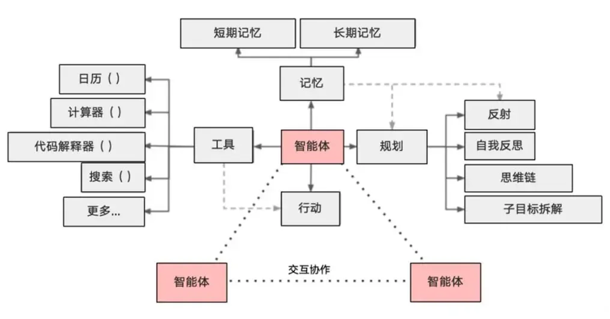

## Agent与Chain的区别
在Chain中行动序列是 `硬编码的`、`固定流程的` ，像是“线性流水线”，而Agent则采用语言模型作为 `推理引擎` ，具备一定的 `自主决策` 能力，来确定以什么样的顺序采取什么样的行动，像是“拥有大脑的机器工人”
它可以根据任务 动态决定 ：
- 如何 拆解任务
- 需要 调用哪些工具
- 以 什么顺序调用
- 如何利用好 中间结果 推进任务

## 什么是agent

Agent（智能体） 是一个通过动态协调 `大语言模型（LLM）` 和 `工具（Tools）` 来完成复杂任务的智能系统。它让LLM充当"决策大脑"，根据用户输入自主选择和执行工具（如搜索、计算、数据库查询等），最终生成精准的响应。

作为一个智能体，需要具备以下核心能力：



1) 大模型(LLM)：作为大脑，提供推理、规划和知识理解能力。
2) 记忆(Memory)：具备短期记忆（上下文）和长期记忆（向量存储），支持快速知识检索。
3) 工具(Tools)：调用外部工具（如API、数据库）的执行单元
4) 规划(Planning)：任务分解、反思与自省框架实现复杂任务处理
5) 行动(Action)：实际执行决策的能力
6) 协作：通过与其他智能体交互合作，完成更复杂的任务目标。


## agent 入门使用

### Agent、AgentExecutor的创建
|          | 环节1：创建Agent                                                           | 环节2：创建AgentExecutor    |
| -------- | --------------------------------------------------------------------- | ---------------------- |
| 方式1：传统方式 | 使用 AgentType 指定                                                       | initialize_agent()     |
| 方式2：通用方式 | create_xxx_agent()比如：create_react_agent()、create_tool_calling_agent() | 调用AgentExecutor() 构造方法 |
### Agent的类型

#### FUNCATION_CALL模式
- 基于 结构化函数调用 （如 OpenAI Function Calling）
- 直接生成工具调用参数（ JSON 格式 ）
- 效率更高，适合工具明确的场景

#### ReAct 模式

- 基于 文本推理 的链式思考（Reasoning + Acting），具备反思和自我纠错能力。
	- 推理（Reasoning）：分析当前状态，决定下一步行动
	- 行动（Acting）：调用工具并返回结果
- 通过 自然语言描述决策过程
- 适合需要明确推理步骤的场景。例如智能客服、问答系统、任务执行等。

**Agent两种典型类型对比表**


| 特性    | Function Call模式 | ReAct 模式     |
| ----- | --------------- | ------------ |
| 底层机制  | 结构化函数调用         | 自然语言推理       |
| 输出格式  | `JSON/结构化数据`    | `自由文本`       |
| 适合场景  | 需要高效工具调用        | 需要解释决策过程     |
| 典型延迟  | 较低 （直接参数化调用）    | 较高 （需生成完整文本） |
| LLM要求 | 需支持函数调用（如gpt-4） | 通用模型即可       |
### AgentExecutor创建方式

**传统方式：initialize_agent()**

特点：
- 内置一些标准化模板（如 ZERO_SHOT_REACT_DESCRIPTION ）
- Agent的创建：使用AgentType
优点：快速上手（3行代码完成配置）
缺点：定制化能力较弱（如提示词固定）

> 注：TS 版 LangChain 中，`initialize_agent()` 对应 `initializeAgentExecutorWithOptions()`；`AgentType` 枚举对应字符串字面量（如 `"zero-shot-react-description"`）。

```ts
import { ChatOpenAI } from "@langchain/openai";
import { Calculator } from "@langchain/community/tools/calculator";
import { initializeAgentExecutorWithOptions } from "langchain/agents";

async function main() {
  // temperature 设为 0，让 LLM 在「选哪个工具、传什么参数」上尽量稳定，不要发散
  const llm = new ChatOpenAI({ model: "gpt-4o-mini", temperature: 0 });

  // 工具列表：Calculator 等价于 Python 版的 load_tools(["llm-math"])
  const tools = [new Calculator()];

  // 传统方式的精髓：tools + llm + agentType 三件套，一行得到 AgentExecutor
  // agentType 字符串就是 Python 里 AgentType.ZERO_SHOT_REACT_DESCRIPTION
  const executor = await initializeAgentExecutorWithOptions(tools, llm, {
    agentType: "zero-shot-react-description",
    verbose: true, // 打开后可以看到 Thought / Action / Observation 全过程
  });

  const result = await executor.invoke({ input: "123 乘以 456 等于多少？" });
  console.log(result.output);
}

main();
```
**通用方式：AgentExecutor构造方法**
特点：
- Agent的创建：使用create_xxx_agent
优点：
- 可自定义提示词（如从远程hub获取或本地自定义）
- 清晰分离Agent逻辑与执行逻辑
缺点：
- 需要更多代码
- 需理解底层组件关系

```ts
import { ChatOpenAI } from "@langchain/openai";
import { Calculator } from "@langchain/community/tools/calculator";
import { AgentExecutor, createReactAgent } from "langchain/agents";
import { pull } from "langchain/hub";
import type { PromptTemplate } from "@langchain/core/prompts";

async function main() {
  const llm = new ChatOpenAI({ model: "gpt-4o-mini", temperature: 0 });
  const tools = [new Calculator()];

  // 通用方式的精髓：提示词「显式可见」，可远程拉、可本地写
  // 远程：从 LangChain Hub 拉官方 ReAct 模板
  const prompt = await pull<PromptTemplate>("hwchase17/react");
  // 本地等价写法（无需联网）：
  // const prompt = PromptTemplate.fromTemplate(`Answer the following questions...{tools}{tool_names}{input}{agent_scratchpad}`);

  // 第一步：构造 Agent —— 只负责"决策下一步做什么"
  const agent = await createReactAgent({ llm, tools, prompt });

  // 第二步：套进 AgentExecutor —— 负责"循环执行 + 调度工具"
  const executor = new AgentExecutor({ agent, tools, verbose: true });

  const result = await executor.invoke({ input: "123 乘以 456 等于多少？" });
  console.log(result.output);
}

main();
```

> 对比上面"传统方式"：同样的问题，**Agent 创建和 Executor 创建被拆成两步**，提示词从黑盒变成了能 `pull` / 能本地改的对象 —— 这就是"可定制"换来的代价（多写几行）。

| 组件                  | 传统方式                       | 通用方式                       |
| ------------------- | -------------------------- | -------------------------- |
| **Agent创建**         | 通过 `AgentType` 枚举选择预设      | 通过 `create_xxx_agent `显式构建 |
| **AgentExecutor创建** | 通过 `initialize_agent()` 创建 | 通过 `AgentExecutor() `创建    |
| **提示词**             | 内置不可见                      | 可以自定义                      |
| **工具集成**            | AgentExecutor中显式传入         | Agent/AgentExecutor中需显式传入  |

## Agent中工具的使用

### 传统方式
#### 案例1 单工具使用

##### 方式1:ReAct模式
AgentType是 ZERO_SHOT_REACT_DESCRIPTION
```ts
import { ChatOpenAI } from "@langchain/openai";
import { Calculator } from "@langchain/community/tools/calculator";
import { initializeAgentExecutorWithOptions } from "langchain/agents";

async function main() {
  const llm = new ChatOpenAI({ model: "gpt-4o-mini", temperature: 0 });
  const tools = [new Calculator()];

  const executor = await initializeAgentExecutorWithOptions(tools, llm, {
    agentType: "zero-shot-react-description", // ReAct：靠工具的 description 自然语言推理
    verbose: true,
  });

  const result = await executor.invoke({ input: "(34 + 56) 乘以 7 等于多少？" });
  console.log(result.output);
}

main();
```

> 观察 `verbose` 输出：会出现 `Thought / Action / Action Input / Observation / Final Answer` 这套 ReAct 标志性结构 —— 这是**自由文本**形式的决策过程。

##### 方式2：FUNCATION_CALL模式
AgentType是 OPENAI_FUNCTIONS

```ts
import { ChatOpenAI } from "@langchain/openai";
import { Calculator } from "@langchain/community/tools/calculator";
import { initializeAgentExecutorWithOptions } from "langchain/agents";

async function main() {
  // Function Call 模式必须用支持 function calling 的模型（gpt-3.5/4/4o 系列均可）
  const llm = new ChatOpenAI({ model: "gpt-4o-mini", temperature: 0 });
  const tools = [new Calculator()];

  const executor = await initializeAgentExecutorWithOptions(tools, llm, {
    agentType: "openai-functions", // Function Call：模型直接吐 JSON 参数，不绕自然语言
    verbose: true,
  });

  const result = await executor.invoke({ input: "(34 + 56) 乘以 7 等于多少？" });
  console.log(result.output);
}

main();
```

> 观察 `verbose` 输出：**没有 `Thought:` 这类文本**，而是直接 `tool_calls: [{ name: "calculator", args: {...} }]` —— 决策被结构化成 JSON，延迟更低、解析更稳。

二者对比：ZERO_SHOT_REACT_DESCRIPTION和OPENAI_FUNCTIONS
#### 案例2 多工具使用

- 需求：
	- 计算特斯拉当前股价是多少？
	- 比去年上涨了百分之几？（提示：调用PythonREPL实例的run方法）
- 多个（两个）工具的选择
##### 方式1:ReAct模式
AgentType是 ZERO_SHOT_REACT_DESCRIPTION
```ts
import { ChatOpenAI } from "@langchain/openai";
import { Calculator } from "@langchain/community/tools/calculator";
import { DynamicTool } from "@langchain/core/tools";
import { initializeAgentExecutorWithOptions } from "langchain/agents";

async function main() {
  const llm = new ChatOpenAI({ model: "gpt-4o-mini", temperature: 0 });

  // mock 一个查股价的工具（生产中可换成 yahoo-finance / Alpha Vantage 等真实 API）
  // 注意：description 必须写清楚"啥时候用 + 输入是什么 + 返回是什么"，这是 LLM 选工具的唯一依据
  const stockPriceTool = new DynamicTool({
    name: "stock_price",
    description:
      "查询股票的当前价和去年同期价。输入参数为股票代码（如 TSLA）。返回 JSON 字符串，包含 current 和 lastYear 两个字段（单位：美元）。",
    func: async (symbol: string) => {
      const mockDb: Record<string, { current: number; lastYear: number }> = {
        TSLA: { current: 280, lastYear: 200 },
      };
      const data = mockDb[symbol.trim().toUpperCase()] ?? { current: 0, lastYear: 0 };
      return JSON.stringify(data);
    },
  });

  const tools = [stockPriceTool, new Calculator()];

  const executor = await initializeAgentExecutorWithOptions(tools, llm, {
    agentType: "zero-shot-react-description",
    verbose: true,
  });

  const result = await executor.invoke({
    input: "特斯拉（TSLA）当前股价是多少？比去年上涨了百分之几？",
  });
  console.log(result.output);
}

main();
```

> 观察过程：Agent 会**先**调用 `stock_price` 拿到 `{current:280, lastYear:200}`，**再**自己组装表达式 `(280-200)/200*100` 调用 `calculator`。这就是"多工具协作"的核心 —— 后一步的输入依赖前一步的输出。

##### 方式2：FUNCATION_CALL模式
AgentType是 **FUNCATION_CALL**

```ts
import { ChatOpenAI } from "@langchain/openai";
import { Calculator } from "@langchain/community/tools/calculator";
import { DynamicTool } from "@langchain/core/tools";
import { initializeAgentExecutorWithOptions } from "langchain/agents";

async function main() {
  const llm = new ChatOpenAI({ model: "gpt-4o-mini", temperature: 0 });

  const stockPriceTool = new DynamicTool({
    name: "stock_price",
    description:
      "查询股票的当前价和去年同期价。输入参数为股票代码（如 TSLA）。返回 JSON 字符串，包含 current 和 lastYear 两个字段。",
    func: async (symbol: string) => {
      const mockDb: Record<string, { current: number; lastYear: number }> = {
        TSLA: { current: 280, lastYear: 200 },
      };
      return JSON.stringify(mockDb[symbol.trim().toUpperCase()] ?? { current: 0, lastYear: 0 });
    },
  });

  const tools = [stockPriceTool, new Calculator()];

  const executor = await initializeAgentExecutorWithOptions(tools, llm, {
    agentType: "openai-functions",
    verbose: true,
  });

  const result = await executor.invoke({
    input: "特斯拉（TSLA）当前股价是多少？比去年上涨了百分之几？",
  });
  console.log(result.output);
}

main();
```

> 同样跑两步工具调用，但每一步都是结构化 JSON。**多工具场景下 Function Call 的优势更明显**：参数解析不会出错，连续调用的稳定性远高于 ReAct。

#### 案例3：自定义函数与工具
需求：计算3的平方，Agent自动调用工具完成

```ts
import { ChatOpenAI } from "@langchain/openai";
import { tool } from "@langchain/core/tools";
import { z } from "zod";
import { initializeAgentExecutorWithOptions } from "langchain/agents";

async function main() {
  const llm = new ChatOpenAI({ model: "gpt-4o-mini", temperature: 0 });

  // 自定义工具的"三件套"：name + description + 真正干活的函数
  // 用 zod 定义参数 schema，LLM 在调用时会按 schema 填参，避免参数出错
  const squareTool = tool(
    async ({ x }) => String(x * x),
    {
      name: "square_number",
      description: "计算一个数的平方。输入一个数字 x，返回 x * x 的结果。",
      schema: z.object({
        x: z.number().describe("要平方的数字"),
      }),
    }
  );

  const executor = await initializeAgentExecutorWithOptions([squareTool], llm, {
    // 自定义工具配 Function Call 模式最稳：参数靠 zod schema 强约束
    agentType: "openai-functions",
    verbose: true,
  });

  const result = await executor.invoke({ input: "请帮我算一下 3 的平方" });
  console.log(result.output);
}

main();
```

> 关键点：自定义工具不是"魔法"，**就是一个普通的 async 函数 + 一段说明书（description）+ 参数 schema**。Agent 之所以能调它，是因为 description 写清楚了"我能做什么、要什么参数"。description 写得好不好，直接决定 Agent 用不用得对你的工具。

### 通用方式
需求：今天北京的天气怎么样？？

### 方式1：FUNCATION_CALL模式

```ts
import { ChatOpenAI } from "@langchain/openai";
import { tool } from "@langchain/core/tools";
import { z } from "zod";
import { AgentExecutor, createToolCallingAgent } from "langchain/agents";
import { ChatPromptTemplate } from "@langchain/core/prompts";

async function main() {
  const llm = new ChatOpenAI({ model: "gpt-4o-mini", temperature: 0 });

  // mock：生产中替换为 OpenWeather / 高德天气等真实 API
  const weatherTool = tool(
    async ({ city }) => {
      const mockDb: Record<string, string> = {
        北京: "晴，25°C，微风",
        上海: "多云，27°C",
      };
      return mockDb[city] ?? `${city} 暂无天气数据`;
    },
    {
      name: "get_weather",
      description: "查询某个城市当前的天气。输入城市名（中文），返回天气描述字符串。",
      schema: z.object({ city: z.string().describe("城市名，如 北京") }),
    }
  );

  const tools = [weatherTool];

  // 通用方式必须自己提供 Prompt（这就是它"可控"的代价）
  // tool-calling agent 的 prompt 必须包含 {agent_scratchpad} 占位符，用来回填工具调用历史
  const prompt = ChatPromptTemplate.fromMessages([
    ["system", "你是一个能帮用户查询天气的助手。"],
    ["human", "{input}"],
    ["placeholder", "{agent_scratchpad}"],
  ]);

  const agent = await createToolCallingAgent({ llm, tools, prompt });
  const executor = new AgentExecutor({ agent, tools, verbose: true });

  const result = await executor.invoke({ input: "今天北京的天气怎么样？" });
  console.log(result.output);
}

main();
```

> 通用方式 + Function Call 是**目前生产环境最推荐的组合**：提示词可控、参数结构化、稳定性最好。`createToolCallingAgent` 是新版 LangChain.js 推荐 API，支持所有兼容 tool calling 的模型（OpenAI/Anthropic/Gemini 等）。

### 方式2：ReAct模式
```ts
import { ChatOpenAI } from "@langchain/openai";
import { tool } from "@langchain/core/tools";
import { z } from "zod";
import { AgentExecutor, createReactAgent } from "langchain/agents";
import { pull } from "langchain/hub";
import type { PromptTemplate } from "@langchain/core/prompts";

async function main() {
  const llm = new ChatOpenAI({ model: "gpt-4o-mini", temperature: 0 });

  const weatherTool = tool(
    async ({ city }) => {
      const mockDb: Record<string, string> = {
        北京: "晴，25°C，微风",
        上海: "多云，27°C",
      };
      return mockDb[city] ?? `${city} 暂无天气数据`;
    },
    {
      name: "get_weather",
      description: "查询某个城市当前的天气。输入城市名（中文），返回天气描述字符串。",
      schema: z.object({ city: z.string().describe("城市名，如 北京") }),
    }
  );

  const tools = [weatherTool];

  // ReAct 提示词从 Hub 拉官方模板（也可以本地用 PromptTemplate.fromTemplate 自己写）
  const prompt = await pull<PromptTemplate>("hwchase17/react");

  const agent = await createReactAgent({ llm, tools, prompt });

  // ReAct 严格要求 LLM 输出含 Thought / Action / Observation 的格式
  // handleParsingErrors=true：解析失败时把错误回灌给 LLM 自我修正，避免直接抛异常崩溃
  const executor = new AgentExecutor({
    agent,
    tools,
    verbose: true,
    handleParsingErrors: true,
  });

  const result = await executor.invoke({ input: "今天北京的天气怎么样？" });
  console.log(result.output);
}

main();
```

ReAct模式可能出错
**错误原因：**

- 使用ReAct模式时，要求 LLM 的响应必须遵循严格的格式（如包含 Thought: 、 Action: 等标记）。
- 但 LLM 直接返回了自由文本（非结构化），导致解析器无法识别。
修改：

- 任务不变，添加 handle_parsing_errors=True 。用于控制 Agent 在解析工具调用或输出时发生错误的容错行为。
**handle_parsing_errors=True 的作用**
- 自动捕获错误并修复：当解析失败时，Agent 不会直接崩溃，而是将错误信息传递给 LLM，让LLM `自行修正并重试`
- 降级处理：如果重试后仍失败，Agent 会返回一个友好的错误消息（如 "I couldn't process that request." ），而不是抛出异常
小结：

| 场景   | handle_parsing_errors=True<br> | handle_parsing_errors=False |
| ---- | ------------------------------ | --------------------------- |
| 解析成功 | 正常执行                           | 正常执行                        |
| 解析失败 | 自动修复或降级响应                      | 直接抛出异常                      |
| 适用场景 | 生产环境（保证鲁棒性                     | 开发调试（快速发现问题）                |
