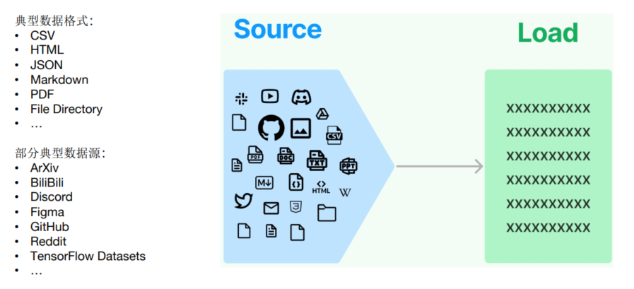
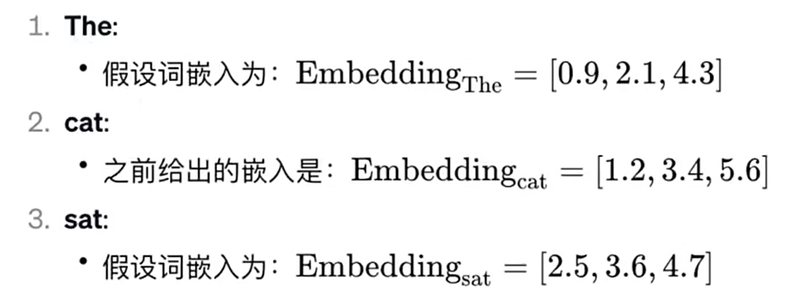
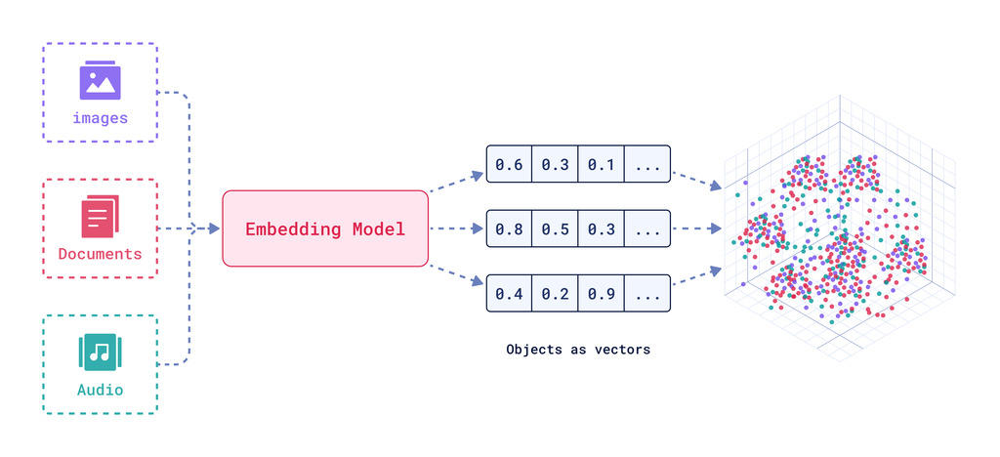
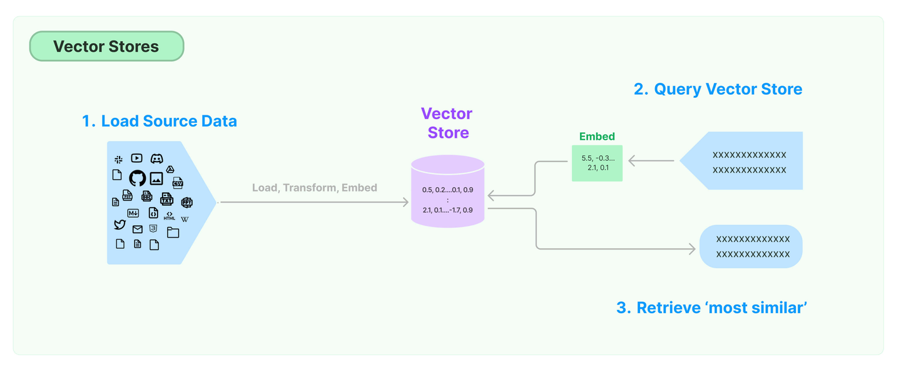

Retrieval直接翻译过来即“检索”，本章Retrieval模块包括与检索步骤相关的所有内容，例如数据的获
取、切分、向量化、向量存储、向量检索等模块。常被应用于构建一个“ 企业/私人的知识库 ”，提升大模型的整体能力。
# Retrieval模块的设计意义
## 大模型的幻觉问题
拥有记忆后，确实扩展了AI工程的应用场景。

但是在专有领域，LLM无法学习到所有的专业知识细节，因此在 `面向专业领域知识` 的提问时，无法给出可靠准确的回答，甚至会“胡言乱语”，这种现象称之为` LLM的“幻觉`


## Rag解决方案
可以说，当应用需求集中在利用大模型去 `回答特定私有领域的知识` ，且知识库足够大，那么除了 `微调大模型` 外， RAG 就是非常有效的一种缓解大模型推理的“幻觉”问题的解决方案

LangChain对这一流程提供了解决方案。

>如果说LangChain相当于给LLM这个“⼤脑”安装了“四肢和躯⼲”，RAG则是为LLM提供了接⼊“⼈类知识图书馆”的能⼒。
### RAG的优缺点

**RAG的优点**
1) 相比提示词工程，RAG有` 更丰富的上下文和数据样本` ，可以不需要用户提供过多的背景描述，就能生成比较符合用户预期的答案。
2) 相比于模型微调，RAG可以提升问答内容的 `时效性` 和 `可靠性`
3) 在一定程度上保护了业务数据的 `隐私性` 。
**RAG的缺点**
1) 由于每次问答都涉及外部系统数据检索，因此RAG的 `响应时延` 相对较高
2) 引用的外部知识数据会 `消耗大量的模型Token 资源`

## Retrieval流程


### 环节1：Source（数据源）
指的是RAG架构中所外挂的知识库。这里有三点说明：
1. 原始数据源类型多样：如：视频、图片、文本、代码、文档等
2. 形式的多样性：
	- 可以是上百个.csv文件，可以是上千个.json文件，也可以是上万个.pdf文件
	- 可以是某一个业务流程外放的API，可以是某个网站的实时数据等
### 环节2：Load（加载）

文档加载器（Document Loaders）负责将来自不同数据源的非结构化文本，加载到 `内存` ，成为 文档(Document)对象 。
文档对象包含 `文档内容` 和相关 `元数据信息` ，例如TXT、CSV、HTML、JSON、Markdown、PDF，甚至YouTube 视频转录等

文档加载器还支持“` 延迟加载` ”模式，以缓解处理大文件时的内存压力。
文档加载器的编程接口使用起来非常简单，以下给出加载TXT格式文档的例子

> 依赖安装：`npm install langchain @langchain/core`

```ts
import { TextLoader } from "langchain/document_loaders/fs/text";

// 1. 创建 TXT 加载器，指向目标文件
const loader = new TextLoader("./data/example.txt");

// 2. load(): 一次性读入内存，返回 Document[]
const docs = await loader.load();

// 3. 每个 Document 都包含两部分：
//    - pageContent: 文档正文（字符串）
//    - metadata:    元数据，如 { source: "./data/example.txt" }
console.log(docs[0].pageContent);
console.log(docs[0].metadata);

// 提示：处理大文件时可改用 loader.lazyLoad()，
// 返回异步迭代器，避免一次性把全部内容读入内存。
```
### 环节3:Transform（转换）
`文档转换器(Document Transformers)`负责对加载的文档进行转换和处理，以便更好地适应下游任务的需求。
文档转换器提供了一致的接口（工具）来操作文档，主要包括以下几类：
- `文本拆分器(Text Splitters)` ：将长文本拆分成语义上相关的小块，以适应语言模型的上下文窗口限制。
- `冗余过滤器(Redundancy Filters)` ：识别并过滤重复的文档
- `元数据提取器(Metadata Extractors)` ：从文档中提取标题、语调等结构化元数据。
- `多语言转换器(Multi-lingual Transformers)` ：实现文档的机器翻译。
- `对话转换器(Conversational Transformers)` ：将非结构化对话转换为问答格式的文档。
总的来说，文档转换器是 LangChain 处理管道中非常重要的一个组件，它丰富了框架对文档的表示和操作能力。

在这些功能中，文档拆分器是必须的操作。下面单独说明。

环节3.1：**Text Splitting（文档拆分）**

- `拆分/分块的必要性` ：前一个环节加载后的文档对象可以直接传入文档拆分器进行拆分，而文档切块后才能` 向量化` 并存入数据库中。
- `文档拆分器的多样性` ：LangChain提供了丰富的文档拆分器，不仅能够切分普通文本，还能切分Markdown、JSON、HTML、代码等特殊格式的文本。
- `拆分/分块的挑战性` ：实际拆分操作中需要处理许多细节问题， 不同类型的文本 、 不同的使用场景 都需要采用不同的分块策略。
	- 可以按照 `数据类型` 进行切片处理，比如针对 `文本类数据` ，可以直接按照字符、段落进行切片； `代码类数据` 则需要进一步细分以保证代码的功能性；
	- 可以直接根据 `token` 进行切片处理

在构建RAG应用程序的整个流程中，拆分/分块是最具挑战性的环节之一，它显著影响检索效果。目前还没有通用的方法可以明确指出哪一种分块策略最为有效。不同的使用场景和数据类型都会影响分块策略的选择。
### 环节4：Embed（嵌入）
文档嵌入模型（Text Embedding Models）负责将 `文本` 转换为`向量`表示 ，即`模型赋予了文本计算机可理解的数值表示`，使文本可用于向量空间中的各种运算，大大拓展了文本分析的可能性，是自然语言处理领域非常重要的技术

实现原理：
- 通过 `特定算法 （如Word2Vec）`将语义信息编码为固定维度的向量，具体算法细节需后续深入。
- 关键特性：`相似的词在向量空间中距离相近`，例如"猫"和"犬"的向量夹角小于"猫"和"汽车"。

文本嵌入为 LangChain 中的问答、检索、推荐等功能提供了重要支持。具体为
- `语义匹配` ：通过计算两个文本的向量余弦相似度，判断它们在语义上的相似程度，实现语义匹配。
- `文本检索` ：通过计算不同文本之间的向量相似度，可以实现语义搜索，找到向量空间中最相似的文本
- `信息推荐` ：根据用户的历史记录或兴趣嵌入生成用户向量，计算不同信息的向量与用户向量的相似度，推荐相似的信息。
- `知识挖掘` ：可以通过聚类、降维等手段分析文本向量的分布，发现文本之间的潜在关联，挖掘知识。
- `自然语言处理` ：将词语、句子等表示为稠密向量，为神经网络等下游任务提供输入
### 环节5：Store（存储）
LangChain 还支持把文本嵌入存储到向量存储或临时缓存，以避免需要重新计算它们。这里就出现了数据库，支持这些嵌入的高效 `存储` 和 `搜索` 的需求。

### 环节6：Retrieve（检索）

检索器（Retrievers）是一种用于` 响应非结构化查询` 的接口，它可以返回符合查询要求的文档。

LangChain 提供了一些常用的检索器，如 `向量检索器` 、 `文档检索器` 、 `网站研究检索器` 等。

通过配置不同的检索器，LangChain 可以灵活地平衡检索的精度、召回率与效率。检索结果将为后续的问答生成提供信息支持，以产生更加准确和完整的回答。