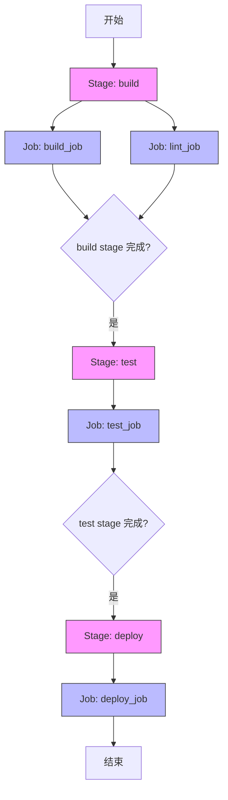

背景：之前就被CICD恶心过，小白表示看不懂，奈何我负责一下新项目的上线部署，要求还要有质量门禁，agent门禁，只能边学边干，效率属实慢的和狗一样，做个文章学习一下基础知识
## 全局关键词
### include
**作用**: 允许在 `.gitlab-ci.yml` 中引入外部配置文件，实现配置复用和模块化。
**使用场景**:
- 多个项目共用相同的 CI 配置
- 将大型配置文件拆分为小的模块
- 在不同环境间共享基础配置
**示例**:
```yaml
include:
  - local: '/templates/.gitlab-ci-template.yml'  # 本地文件
  - project: 'my-group/my-project'              # 其他项目
    file: '/templates/template.yml'
  - remote: 'https://example.com/ci-template.yml' # 远程文件
```

### stage
**作用**: 定义 CI/CD 流水线的执行阶段，控制作业的执行顺序。
**特点**:
- 同一 stage 的作业并行执行
- 不同 stage 按定义顺序依次执行
- 前一个 stage 成功后才会执行下一个 stage

**示例**:
```yaml
stages:
  - build
  - test
  - deploy

build_job:
  stage: build
  script:
    - echo "编译代码"
    - npm run build

lint_job:
  stage: build
  script:
    - echo "质量检查"
    - npm run lint

test_job:
  stage: test
  script:
    - echo "运行测试"
    - npm test

deploy_job:
  stage: deploy
  script:
    - echo "部署应用"
    - npm run deploy
```

**并行执行示意图**:


**执行时序图**:

```mermaid
gantt
    title GitLab CI/CD 执行时序
    dateFormat  HH:mm:ss
    section Stage: build
    build_job         :a1, 00:00:00, 30s
    lint_job          :a2, 00:00:00, 45s
    
    section Stage: test  
    test_job          :a3, after a2, 20s
    
    section Stage: deploy
    deploy_job        :a4, after a3, 15s
```


### job

**作用**: 定义 CI/CD 流水线中的具体执行任务，是 GitLab CI/CD 的基本执行单元。

**核心特性**:
- 每个 job 必须指定一个 `stage`
- 同一 stage 的 job 并行执行
- 不同 stage 的 job 按 stage 顺序串行执行
- 每个 job 在独立的容器/虚拟机中运行

**必填字段**:
- `stage`: 指定 job 所属的阶段
- `script`: 定义要执行的命令脚本

**常用字段**:
- `image`: 指定运行的 Docker 镜像
- `variables`: 定义 job 级别的变量
- `rules`: 定义 job 的执行条件
- `only/except`: 旧版条件控制（推荐使用 rules）
- `needs`: 定义 job 间的依赖关系（打破 stage 限制）
- `artifacts`: 定义构建产物
- `cache`: 定义缓存策略
- `before_script/after_script`: 前置/后置脚本
- `retry` 失败重试次数
**示例**:
```yaml
stages:
  - build
  - test
  - deploy

# 基础 job 示例
build_job:
  stage: build
  script:
    - echo "开始编译"
    - npm install
    - npm run build

# 带条件的 job
test_job:
  stage: test
  script:
    - echo "运行测试"
    - npm test
  rules:
    - if: '$CI_COMMIT_BRANCH != "main"'  # 非 main 分支才运行测试

# 带产物的 job
deploy_job:
  stage: deploy
  script:
    - echo "部署应用"
    - scp -r dist/ user@server:/app/
  artifacts:
    paths:
      - dist/
    expire_in: 1 week

# 并行执行的 job
lint_job:
  stage: build  # 与 build_job 同 stage，会并行执行
  script:
    - echo "代码检查"
    - npm run lint
```

**job 命名规范**:
- 使用小写字母、数字和下划线
- 具有描述性，反映 job 的功能
- 避免使用特殊字符和空格

**最佳实践**:
1. **单一职责**: 每个 job 只负责一个明确的任务
2. **原子性**: job 应该是可独立执行的单元
3. **幂等性**: 多次执行 job 应该产生相同的结果
4. **超时控制**: 合理设置 job 执行超时时间
5. **错误处理**: 在 script 中添加适当的错误检查

### 🔗 YAML 锚点和别名

**作用**: 实现 job 配置的复用，避免重复代码，提高维护性。

**语法**:
- **锚点定义**: `&锚点名` 
- **别名引用**: `*锚点名`
- **多行文本**: `>-` (折叠换行符)

**常用场景**:
- 复用 curl 命令模板
- 统一的错误处理逻辑
- 通用的环境检查脚本
- 标准的部署流程

**示例**:
```yaml
# 定义锚点
.curl_template: &api_call >-
  /busybox/curl --retry 3 --retry-delay 10 -s -X POST \
  -H "Content-Type: application/json" \
  -H "X-Gitlab-Token: ${API_TOKEN}" \
  --data-binary "$REQUEST_DATA" \
  ${API_ENDPOINT} > response.json

.error_check: &check_result
  - cat response.json
  - if [[ $(cat response.json | jq '.code') -ne 10000 ]]; then exit 1; fi

.deploy_steps: &deploy_flow
  - echo "开始部署: $CI_JOB_NAME"
  - echo "目标镜像: $DOCKER_IMAGE"
  - *api_call
  - *check_result
  - echo "部署完成"

# 使用锚点
build_job:
  stage: build
  script:
    - *deploy_flow
  variables:
    DOCKER_IMAGE: my-app:$CI_COMMIT_SHORT_SHA
    API_ENDPOINT: "https://api.example.com/deploy"
    REQUEST_DATA: |
      {
        "image": "$DOCKER_IMAGE",
        "pipeline_id": $CI_PIPELINE_ID,
        "commit_sha": "$CI_COMMIT_SHA",
        "environment": "staging"
      }

test_job:
  stage: test  
  script:
    - echo "测试环境部署"
    - *deploy_flow
  variables:
    DOCKER_IMAGE: my-app-test:$CI_COMMIT_SHORT_SHA
    API_ENDPOINT: "https://api.example.com/deploy"
    REQUEST_DATA: |
      {
        "image": "$DOCKER_IMAGE",
        "pipeline_id": $CI_PIPELINE_ID,
        "commit_sha": "$CI_COMMIT_SHA",
        "environment": "test"
      }
```

**优势**:
1. **代码复用**: 多个 job 可以共享相同的逻辑
2. **维护性**: 修改只需在一个地方进行
3. **可读性**: 使 job 配置更简洁
4. **一致性**: 确保所有相关 job 使用相同的处理逻辑

**注意事项**:
- 锚点名称以 `.` 开头（如 `.curl_template`）表示私有锚点
- 使用 `>-` 处理多行命令时，会折叠换行符为空格
- 引用锚点的变量会在实际使用时展开

### variables

**作用**: 定义全局或局部的环境变量，在 CI/CD 过程中使用。

**变量优先级** (从高到低):
1. 作业级别的 variables
2. 项目级别的 variables  
3. 全局 variables
4. 预定义变量 (如 CI_COMMIT_SHA)

**示例**:
```yaml
variables:
  NODE_ENV: "production"
  DOCKER_REGISTRY: "registry.example.com"
  BUILD_VERSION: "1.0.0"

build_job:
  variables:
    NODE_ENV: "development"  # 覆盖全局变量
  script:
    - echo "Building for $NODE_ENV"
    - echo "Version: $BUILD_VERSION"
```

### workflow

**作用**: 控制 CI/CD 流水线的整体行为，如是否创建流水线、运行规则等。

**常用规则**:
- `rules`: 定义流水线创建的条件
- `auto_cancel`: 自动取消正在运行的流水线
- `name`: 为流水线命名

**示例**:
```yaml
workflow:
  rules:
    - if: '$CI_COMMIT_BRANCH == "main"'        # main 分支总是创建流水线
    - if: '$CI_COMMIT_TAG'                      # 标签提交时创建
    - if: '$CI_PIPELINE_SOURCE == "merge_request_event"'  # MR 时创建
    - when: never                               # 其他情况不创建

# 或者使用更复杂的规则
workflow:
  rules:
    - if: '$CI_COMMIT_MESSAGE =~ /skip-ci/'     # 提交信息包含 skip-ci 时不运行
      when: never
    - if: '$CI_COMMIT_BRANCH =~ /^feature\//'   # feature 分支时运行
      when: always
```

## 预定义变量

GitLab CI/CD 提供了丰富的预定义变量，**所有预定义变量都以 `CI_` 开头**，用于在流水线中获取项目、提交、流水线等信息。这些变量由 GitLab 自动注入，无需手动定义即可在 `.gitlab-ci.yml` 中直接使用。

### 🔹 核心提交变量

| 变量名                   | 描述           | 使用场景      | 示例                       |
| --------------------- | ------------ | --------- | ------------------------ |
| `CI_COMMIT_BRANCH`    | 当前分支名称       | 分支相关逻辑判断  | `main`, `feature/login`  |
| `CI_COMMIT_TAG`       | 标签名称（仅标签触发时） | 发布版本控制    | `v1.2.3`, `release-2024` |
| `CI_COMMIT_SHA`       | 完整提交SHA哈希值   | 版本标识、缓存键  | `a1b2c3d4e5f6789...`     |
| `CI_COMMIT_SHORT_SHA` | 简短提交SHA（8位）  | 显示友好版本号   | `a1b2c3d4`               |
| `CI_COMMIT_REF_NAME`  | 分支或标签名称      | 通用引用名称    | `main`, `v1.0.0`         |
| `CI_COMMIT_MESSAGE`   | 提交信息         | 条件判断、日志记录 | `feat: 添加新功能`            |

### 🔹 流水线控制变量

| 变量名                  | 描述        | 使用场景       | 示例                                               |
| -------------------- | --------- | ---------- | ------------------------------------------------ |
| `CI_PIPELINE_SOURCE` | 流水线触发来源   | 区分触发方式     | `push`, `web`, `schedule`, `merge_request_event` |
| `CI_PIPELINE_ID`     | 全局唯一流水线ID | 日志追踪、API调用 | `1001`                                           |
| `CI_PIPELINE_IID`    | 项目内流水线ID  | 内部引用       | `45`                                             |

### 🔹 项目信息变量

| 变量名               | 描述     | 使用场景        | 示例                       |
| ----------------- | ------ | ----------- | ------------------------ |
| `CI_PROJECT_NAME` | 项目名称   | 构建镜像名称、部署路径 | `my-app`                 |
| `CI_PROJECT_ID`   | 项目唯一ID | API调用、资源标识  | `123`                    |
| `CI_PROJECT_PATH` | 项目完整路径 | 日志显示、URL构建  | `group/subgroup/project` |

### 🔹 作业和环境变量

| 变量名 | 描述 | 使用场景 | 示例 |
|--------|------|----------|------|
| `CI_JOB_NAME` | 当前作业名称 | 条件判断、日志 | `build`, `test`, `deploy` |
| `CI_JOB_ID` | 作业唯一ID | 资源清理、追踪 | `5001` |
| `CI_JOB_TOKEN` | API认证token | GitLab API调用 | `glpat-xxx` |
| `CI_ENVIRONMENT_NAME` | 部署环境名称 | 环境相关配置 | `production`, `staging` |

### 💡 常用使用示例

```yaml
# 分支相关条件判断
build_job:
  script:
    - echo "构建分支: $CI_COMMIT_BRANCH"
    - echo "提交SHA: $CI_COMMIT_SHORT_SHA"
  rules:
    - if: '$CI_COMMIT_BRANCH == "main"'
      variables:
        NODE_ENV: "production"
    - if: '$CI_COMMIT_BRANCH =~ /^feature\//'
      variables:
        NODE_ENV: "development"

# 标签发布流程
release_job:
  script:
    - echo "发布版本: $CI_COMMIT_TAG"
    - echo "发布SHA: $CI_COMMIT_SHA"
  rules:
    - if: '$CI_COMMIT_TAG'  # 仅当有标签时运行

# 流水线来源判断
deploy_job:
  script:
    - | 
      if [ "$CI_PIPELINE_SOURCE" = "schedule" ]; then
        echo "定时任务部署"
      elif [ "$CI_PIPELINE_SOURCE" = "web" ]; then
        echo "手动触发部署"
      else
        echo "代码推送触发部署"
      fi
```

### 📝 重要说明

- `CI_COMMIT_BRANCH` 仅在分支触发时存在，标签触发时为空
- `CI_COMMIT_TAG` 仅在标签触发时存在，分支触发时为空  
- `CI_PIPELINE_SOURCE` 常见值：`push`(代码推送), `web`(手动触发), `schedule`(定时任务), `merge_request_event`(MR触发)
- 使用 `CI_COMMIT_SHORT_SHA` 可以获得更友好的8位短SHA显示

