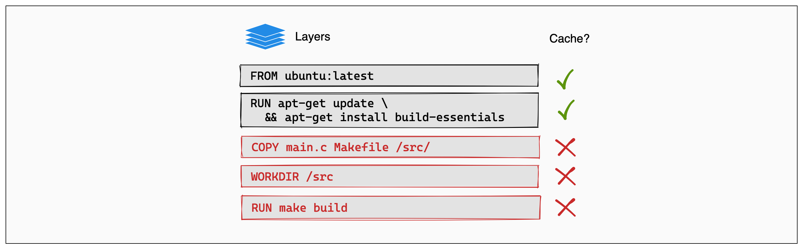

## Docker基本操作
### 更换镜像源
```plain
sudo mkdir -p /etc/docker # 创建docker配置文件
vim /etc/docker/daemon.json # 编辑配置文件
```

```plain

{
    "registry-mirrors": [
        "https://docker.1ms.run",
        "https://registry.docker-cn.com",			
        "https://dockerhub.azk8s.cn",
        "https://mirror.baidubce.com", 
        "https://docker.mirrors.ustc.edu.cn", 
        "https://hub-mirror.c.163.com",          
        "https://docker.nju.edu.cn",              
        "https://docker.m.daocloud.io"           
    ]

}
```

[https://github.com/dongyubin/DockerHub](https://github.com/dongyubin/DockerHub) 可以看看国内的加速源

```plain
sudo systemctl daemon-reexec 
sudo systemctl restart docker
docker info # 查看配置是否生效
```

### 拉取镜像
```plain
docker pull 镜像名称
```

### 查看镜像 
```plain
docker images
```

### 删除镜像
```plain
docker rmi [imageName]
```

### 镜像生成容器
```plain
docker run --name my-container -p 8080:80 -d nginx 
# 用镜像名称为imageName的镜像 生成容器（my-container） 并且 将外层8000端口与容器内80端口相映射
docker run -itd -p 8000:80 --name my-container imageName
```

| 参数 | 含义 | 说明 | 记忆技巧 |
| --- | --- | --- | --- |
| `-i` | 交互模式（interactive） | 保持标准输入流打开，支持交互操作 | i = input（输入） |
| `-t` | 伪终端（tty） | 分配伪终端，使输出格式化，支持命令行交互 | t = terminal（终端） |
| `-d` | 后台运行（detached） | 容器在后台运行，不占用当前终端<br/><font style="color:#DF2A3F;">如果你没有加 </font>`<font style="color:#DF2A3F;">-d</font>`<font style="color:#DF2A3F;">，容器会占据终端，按下 Ctrl+C 会停止容器。</font> | d = detached（分离） |
| `-p 主机端口:容器端口` | 端口映射 | 将宿主机端口映射到容器内部端口，方便访问容器服务 | p = port（端口） |
| -v | 挂在文件 | **<font style="color:rgb(68, 114, 196);background-color:rgb(238, 240, 244);">-v 挂载文件，格式为：宿主机绝对路径目录:容器内目录，</font>** |  |


### 查看容器
```plain
docker ps  # 查看当前运行的容器
docker ps -a #查看所有容器
```

### 进入容器
```plain
docker exec -it [contianer-name or id] bash or sh
```

docker exec -it [contianer-name or id] bash or sh

### 退出容器
```plain
exit
```

### 暂停与恢复容器
```plain
docker pause my-container
docker unpause my-container


docker stop my-container
docker start my-container
```

### 删除容器
```plain
docker rm my-container
```

## DockerFile
**<font style="color:rgb(40, 40, 40);">Dockerfile</font>**<font style="color:rgb(40, 40, 40);">是用来构建Docker镜像的文本文件，是由一条条构建镜像所需的指令和参数构成的脚本。</font>

**<font style="color:rgb(40, 40, 40);">构建三步骤：</font>**

1. <font style="color:rgb(40, 40, 40);">编写Dockerfile文件</font>
2. <font style="color:rgb(40, 40, 40);">docker build命令构建镜像</font>
3. <font style="color:rgb(40, 40, 40);">docker run依镜像运行容器实例</font>

```plain
# 构建镜像 （需要在Dockerfile同级目录下构建）
docker build -t create-react-web .

# 说明（-t：设置 镜像的名字及tag）（最后的. 为当前目录）
```

```plain
WORKDIR /app
指定在创建容器后，终端默认登陆的进来工作目录，一个落脚点

RUN
容器构建时需要运行的命令
两种格式
 
shell格式（1）
RUN yum -y install vim

COPY <源路径> <目标路径>
```


## docker compose yaml
编写yaml文件  进入yaml文件同级目录 

```plain
version: "3.9"

services:

  # ==============================
  # Go 服务
  # ==============================
  account-server:
    build:
      context: ../        # Dockerfile 构建上下文
      dockerfile: Dockerfile
    container_name: account-server
    restart: always

    ports:
      - "8080:8080"

    environment:
      DB_HOST: mysql
      DB_PORT: 3306
      REDIS_HOST: redis
      REDIS_PORT: 6379

    volumes:
      # 挂载日志目录（不要用 .）
      - ../logs/account:/app/logs

    depends_on:
      - mysql
      - redis

    networks:
      - backend-net


  # ==============================
  # MySQL
  # ==============================
  mysql:
    image: mysql:8.0
    container_name: mysql-server
    restart: always

    ports:
      - "3306:3306"

    environment:
      MYSQL_ROOT_PASSWORD: root
      MYSQL_DATABASE: account
      MYSQL_USER: account_user
      MYSQL_PASSWORD: account_pass

    volumes:
      # 数据持久化
      - ../data/mysql:/var/lib/mysql

      # 初始化SQL
      - ../deploy/mysql/init:/docker-entrypoint-initdb.d

    command: >
      --default-authentication-plugin=mysql_native_password
      --character-set-server=utf8mb4
      --collation-server=utf8mb4_unicode_ci

    networks:
      - backend-net


  # ==============================
  # Redis
  # ==============================
  redis:
    image: redis:7
    container_name: redis-server
    restart: always

    ports:
      - "6379:6379"

    volumes:
      - ../data/redis:/data

    command: redis-server --appendonly yes

    networks:
      - backend-net


  # ==============================
  # Nginx
  # ==============================
  nginx:
    image: nginx:latest
    container_name: nginx-server
    restart: always

    ports:
      - "80:80"
      - "443:443"

    volumes:
      # nginx配置
      - ../deploy/nginx/nginx.conf:/etc/nginx/nginx.conf

      # 静态文件
      - ../static:/usr/share/nginx/html

      # nginx日志
      - ../logs/nginx:/var/log/nginx

    depends_on:
      - account-server

    networks:
      - backend-net


# ==============================
# 网络
# ==============================
networks:
  backend-net:
    driver: bridge
```

### 启动和关闭
```bash
docker compose up        # 启动并在前台输出日志
docker compose up -d     # 启动并在后台运行（常用）
docker compose start     # 启动已经创建过的容器（不会重新创建）
```

```bash
docker compose stop      # 停止容器但不删除
docker compose down      # 停止并删除容器、网络、挂载的卷（完整清理）
docker compose restart   # 重启容器
```

## 镜像三种模式

### slim
**特点：** 精简版镜像，移除了不必要的文档、本地化文件和调试工具
**体积：** 相对较小，比标准镜像小30-50%
**适用场景：** 生产环境部署，需要平衡体积和功能性的场景
**优点：** 保持了较好的兼容性，体积适中
**缺点：** 缺少一些开发调试工具

### alpine
**特点：** 基于Alpine Linux，使用musl libc和busybox
**体积：** 最小，通常只有5-10MB
**适用场景：** 对镜像体积要求严格的场景，云原生应用
**优点：** 极致的体积优化，安全性较好
**缺点：** 可能与某些glibc应用存在兼容性问题，软件包较少

**musl libc：** 轻量级C标准库，相比glibc体积更小，启动更快，但功能相对简化
**busybox：** 集成多个常用Linux命令的一体化工具集，通过代码复用大幅减少体积

### bullseye
**特点：** 基于Debian 11 "Bullseye"稳定版本
**体积：** 相对较大，功能完整
**适用场景：** 需要完整Debian环境，开发测试环境
**优点：** 软件包丰富，兼容性好，稳定性高
**缺点：** 镜像体积较大

**选择建议：**
- 追求极致体积 → alpine
- 生产环境平衡选择 → slim  
- 需要完整功能 → bullseye


## 镜像分层与构建缓存

### 1. 镜像 = 只读层叠加

- 每条 Dockerfile 指令产生一层，层只存"差异"，按内容 hash 寻址 → 内容不变就能复用。
- 镜像 = 多个只读层 + 容器可写层，OverlayFS 叠出来的视图。


### 2. 层缓存命中规则

逐条比对"指令 + 输入"，一致则 `CACHED` 跳过；否则重跑，且**之后的层全部失效**（hash 链断）。



如图：`COPY main.c Makefile /src/` 这一层因为文件内容变了导致 cache miss，**它下面的 `WORKDIR` 和 `RUN make build` 即使指令本身没变，也会一起失效**——这就是 hash 链断裂的可视化效果。

| 指令 | 判断依据 |
| --- | --- |
| `RUN` | 命令字符串本身（不看产物） |
| `COPY` / `ADD` | 文件内容 checksum |
| `FROM` | 基础镜像 digest |
| `ARG` / `ENV` | 影响后续指令时参与 hash |

→ **指令顺序 = 缓存效率**，变化频率低的放前面。

### 3. 黄金法则：先 lock，后源码

```dockerfile
COPY package.json pnpm-lock.yaml ./
RUN pnpm install        # lock 不变就 CACHED
COPY . .
RUN pnpm build
```

反过来 `COPY . .` 在前，源码一改 install 就重跑。

### 4. BuildKit cache mount（第二层缓存）

层缓存粒度太粗：lock 改一个包，install 整层失效要重新下载所有包。cache mount 在 RUN 时挂一块**跨构建持久化、不进镜像**的目录：

```dockerfile
RUN --mount=type=cache,id=pnpm-store,target=/root/.local/share/pnpm/store \
    pnpm install --frozen-lockfile
```

`sharing`：`shared`（默认，并发共享）/ `locked`（写互斥，pnpm 用这个）/ `private`。

| 维度 | 层缓存 | cache mount |
| --- | --- | --- |
| 进镜像 | 是 | 否 |
| 粒度 | 整条指令 | 目录级文件 |
| 失效后果 | 整层重做 | RUN 重跑但内部复用 |

两者**叠加使用**：层缓存最优，命中不了靠 cache mount 兜底。

### 5. Multi-stage：构建环境与运行环境分离

```dockerfile
FROM node:20 AS builder
COPY package.json pnpm-lock.yaml ./
RUN pnpm install
COPY . .
RUN pnpm build

FROM nginx:alpine
COPY --from=builder /app/dist /usr/share/nginx/html
```

最终镜像 = 最后一个 `FROM` 的层 + 显式 `COPY --from` 进来的文件，前面阶段完全丢弃。

### 6. Multi-stage 并行构建

BuildKit 把 Dockerfile 解析成 **DAG**（节点 = stage，边 = `COPY --from=`），**无依赖的 stage 自动并行**。

```dockerfile
FROM node:20 AS web
RUN pnpm install && pnpm build         # 阶段 A

FROM golang:1.22 AS api
RUN go build -o api ./cmd/api          # 阶段 B（与 A 无依赖 → 并行）

FROM nginx:alpine AS runtime
COPY --from=web /app/dist /usr/share/nginx/html
COPY --from=api /src/api  /usr/local/bin/api
```

触发条件：
- 用 BuildKit（`docker buildx build` 或 `DOCKER_BUILDKIT=1`）。
- stage 之间无依赖链。
- 从最终目标（默认最后一个，或 `--target xxx`）反向遍历 DAG，无关 stage 直接跳过。

价值：前后端 / monorepo 多服务一次性并行打包；`--target deps` 可单独构建某阶段。
注意：并行吃 CPU/内存，CI runner 资源不足反而更慢。

### 7. 远端缓存（CI 必备）

CI 每次环境都是空的，把缓存推到 registry：

```bash
docker buildx build \
  --cache-from type=registry,ref=registry.xxx/app:buildcache \
  --cache-to   type=registry,ref=registry.xxx/app:buildcache,mode=max \
  -t registry.xxx/app:latest --push .
```

`mode=max` 连 multi-stage 中间层都推，命中率最高（缓存体积变大）。
老做法 `BUILDKIT_INLINE_CACHE=1` 把缓存信息嵌进镜像本身，缺点是中间层缓存不到。

### 8. 缓存失效常见坑

1. 没写 `.dockerignore` → `node_modules` / `.git` / `dist` 进 context，`COPY . .` 永远失效。
2. `RUN echo $(date)`、动态 `ARG BUILD_TIME` 这种"每次不同"的输入，下面缓存全废。
3. 基础镜像用 `:latest` → 上游一更新缓存清零，生产固定版本或 digest。
4. `package.json` 或 `pnpm-lock.yaml` 任一变化都会让 install 层失效。
5. RUN 粒度：会一起变的合并，变化频率不同的拆开。

### 参考文档

**Docker 基础与层缓存**
- [Docker 概念总览](https://docs.docker.com/get-started/overview/)
- [Dockerfile 与镜像层概念](https://docs.docker.com/build/concepts/dockerfile/)
- [构建缓存怎么工作](https://docs.docker.com/build/cache/)
- [优化构建缓存（实战）](https://docs.docker.com/build/cache/optimize/)
- [Dockerfile 最佳实践](https://docs.docker.com/build/building/best-practices/)

**BuildKit / cache mount / 远端缓存**
- [BuildKit 总览](https://docs.docker.com/build/buildkit/)
- [`RUN --mount` 全部类型](https://docs.docker.com/reference/dockerfile/#run---mount)
- [cache mount 详解](https://docs.docker.com/build/cache/optimize/#use-cache-mounts)
- [`--cache-from` / `--cache-to` 后端](https://docs.docker.com/build/cache/backends/)
- [Registry 作为 cache backend](https://docs.docker.com/build/cache/backends/registry/)
- [`docker buildx build` 命令参考](https://docs.docker.com/reference/cli/docker/buildx/build/)

**Multi-stage 与并行构建**
- [Multi-stage builds](https://docs.docker.com/build/building/multi-stage/)

**Dockerfile 指令参考**
- [Dockerfile 完整 reference](https://docs.docker.com/reference/dockerfile/)
- [`.dockerignore` 文件](https://docs.docker.com/build/concepts/context/#dockerignore-files)

**pnpm 在 Docker / CI 里的官方建议**
- [pnpm 的 Docker 集成](https://pnpm.io/docker)
- [pnpm 的 CI 集成（含 GitLab cache）](https://pnpm.io/continuous-integration#gitlab-ci)
- [pnpm `store-dir` 配置](https://pnpm.io/settings#store-dir)
- [`packageManager` 字段（Corepack 锁版本）](https://pnpm.io/installation#using-corepack)

**GitLab CI 缓存（备查）**
- [GitLab CI `cache` 关键字](https://docs.gitlab.com/ee/ci/yaml/#cache)
- [`cache:key:files`](https://docs.gitlab.com/ee/ci/yaml/#cachekeyfiles)
- [`cache:policy`](https://docs.gitlab.com/ee/ci/yaml/#cachepolicy)
- [`cache:fallback_keys`](https://docs.gitlab.com/ee/ci/yaml/#cachefallback_keys)
- [GitLab Runner `[runners.cache]`](https://docs.gitlab.com/runner/configuration/advanced-configuration.html#the-runnerscache-section)
- [K8s executor cache 配置](https://docs.gitlab.com/runner/executors/kubernetes/index.html#configure-cache)


