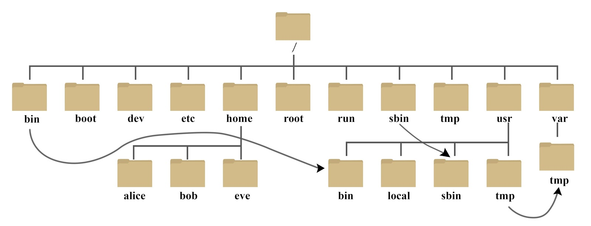

# 基础
### 远程连接服务器
ssh root@47.108.25.26 

@Ly5201314

### 文件目录
/ 是根目录

～是家目录

### 指令
#### ls
ls [-a -l -h ]  [Linux目录]

-a  全部文件 包含隐藏 . 文件

-l 已列表的形式

-h 文件大小、

#### cd pwd命令
cd 进入工作目录

pwd 当前工作目录 Print Work Directory


#### 相对路径
. 表示当前目录

.. 表示上一级目录

~ 表示 HOME目录

#### mkdir
mkdir [-p] Linux路径

-p 表示自动默认创建不存在的目录


#### 文件操作
##### 创建
touch test.txt 创建 test.txt文件

##### 查看
cat 查看文件

more 翻页查看

##### 拷贝
**cp [r] path1  path2**

从文件1 路径 复制**到**path2 

-r 表示复制文件夹 能递归复制

**mv  path1  path2** 没有其他参数了  如果没有path2 则将改名

比如： mv text1.txt text2.txt

将 text1.txt  改名为text2.txt

##### 删除
rm [-r -f] 

-r 表示文件夹 -f 表示强制删除

##### 查找
1. which
    - 查找命令的程序文件
    - 语法: which 要查找的命令
    - 无需选项，只需要参数表示查找那个命令
2. find命令
    1. 查找指定文件
    2. 按文件名查找 **find [起始路径] -name "被查找的文件" **双引号引起来
    3. 按文件大小查找 **find [起始路径] -size  [+-]  [kMG]**

#### grep 命令
语法： grep [-n] 关键字 文件路径

+ -n 可选表示显示匹配的行的行号
+ 参数关键子 必填，表示过滤的关键字，带有空格或其他特殊符号 建议用"" 将关键字包裹起来
+ 参数，文件路径必填，表示要过滤内容的文件路径，**可作为文件输入端口**

管道符 ｜

cat text.txt | grep "qa" 

管道符 ｜ 表示将左边的结果 作为右边的输入

#### 输出 echo 重定向 以及tail
##### echo
echo "hello" 

echo ` grep -n  “hellow” /` ` 表示 会作为命令输出

比如 输出` grep -n  “hellow” /` 起始会执行命令  grep -n  “hellow” /

**` 表示会被作为命令执行，而不是不同字符串**

##### 重定向符 >   >>
  > 表示 将左边的内容**覆盖写入**右边的内容

>> 表示将左边的内容**追加到**右边的内容

echo "hellow" > text.txt. 覆盖写入

echo "hellow" >> text.txt 追加到末尾

##### tail
tail 查看文件尾部内容 并且可以持续跟踪

语法 tail -f -num 文件名称

-f表示持续跟踪 

-num 表示文件行数 默认10行

## 第三章
#### root 用户
<!-- 这是一张图片，ocr 内容为：在前面,我们接触过SU命令切换到ROOT账户. SU命令就是用于账户切换的系统命令,其来源英文单词:SWITCHUSER 语法:SU[-][用户名] -符号是可选的,表示是否在切换用户后加载环境变量(后续讲解),建议带上 参数:用户名,表示要切换的用户,用户名也可以省略,省略表示切换到ROOT 切换用户后,可以通过EXIT命令退回上一个用户,也可以使用快捷键:CTRL+D 使用普通用户,切换到其它用户需要输入密码,如切换到ROOT用户 使用ROOT用户切换到其它用户,无需密码,可以直接切换 -->


```plain
su - root
```

**sudo  其他命令 **表示【其他命令】临时以超级管理员权限运行

为普通用户提供sudo认证

```plain
vi sudo
# 在最后一行添加
user ALL=(ALL)  NOPASSWD:ALL
```

#### 用户&用户组
##### 用户组
```plain
groupadd test # 增加用户组
groupdel test # 删除用户组

```

##### 用户
创建用户 useradd  -[g dm] username

+ -g 指定用户组 没有指定则默认创建同名的用户组
+ -d 指定用户的HOME路径
+ -m 表示创建home目录

删除用户

+ userdel [-r] 删除用户的HOME目录

#### 权限
<!-- 这是一张图片，ocr 内容为：LIB64 LIB LOST+FOUND BOOT ETC SRV MNT PROC RUN -L2 ROOT@LY://# LS 3 60 TOTAL 1471 7 JUN 25 16:50 BIN -> USR/BIN ROOT ROOT RWXRWXRWY BOOT 4096 JUN 25 17:09 MRWXR-XR- ROOT ROOT 10:57 DEV 22 3920 SEP ROOT DRWXR-XR- ROOT 4096 91 19:50 G11111242333 HRWXR-XR 9 DEC ETC ROOT ROOT 4096 6 HOME 19:50 ROOT DEC DRWXR-XR ROOT O LIB 7 JUN 25 16:50 USR/LIB RWXRWXRW ROOT ROOT 9 JUN 25 16:50 LIB32 USR/LIB32 ROOT IV ROOT RWXRWXRWXRW 9 JUN 25 16:50 LIB64 USR/LIB64 IV ROOT ROOT RWXRWXRW) 10 JUN 25 16:50 LIBX32 ROOT ROOT USR/LIBX32 IV RWXRWXRWX 16384 JUN 25 16:49 LOST+FOUND ARWX----- ROOT ROOT 4096 JUN 25 16:50 ROOT MEDIA ROOT DRWXR-XR- 1 2020 MNT 4096 AUG ARWXR-XR-> ROOT ROOT 4096 2 13:58 AUG ROOT ROOT RWXR-XR- OPT 2 13:52 0 AUG 173 ROOT ROOT PROC 2 15:23 4096 AUG ROOT ROOT DRWX ROOT 20:36 27 860 DEC 9 ROOT ROOT RUN 8 12 JUN 25 16:50 USR/SBIN SBIN ROOT ROOT IV RWXRWXRW> 4096 1 2020 AUG ROOT DRWXR-XR-> ROOT SRV 0 2 13:52 13 AUG AR-XR-XR-> SYS ROOT ROOT 10 4096 19:21 DEC -->


<!-- 这是一张图片，ocr 内容为：1.LS-L列出的权限信息如何解读 [ITHEIMA@LOCALHOST~]$ 1S-L 总用量 序号1,表示文件,文件夹的权限控制信息 23 03:17 DESKIOP 1THEIMA379月 THEIMA DRWXR. 22 23:57 DCCU TANTS 69月 ITHEIMA DRWXR-XR ITHEIMA 69月 22 23:57     22ADS ITHEIMA ITHEIMA DRWXR-XR 序号2,表示文件,文件夹所属用户 09月 2600:16 HELLO.TXT ITHEIMA THEIMA -RW-RW-R 22  23:57 MUSIC 69月 LTHEIMA 22 23:57 PICTURES 69月 THEIMA 序号3,表示文件,文件夹所属用户组 22  23:57 PLBLIG 69月 ITHEIMA THEIMA 22 23:57 TEMPLAT ES 69月 THEIMA 22  23:57 VIDEOS 69月 2.权限细节如何解读 所属用户权限 其它用户权限 所属用户组权限 R或 R或 X或 或D或! X或 W或 W或 X或 W或 表示文件 D表示文件夹 表示软链接 -->


有10个槽位

+ r read表示有读权限
+ w  write表示有写权限
+ x excute表示可以将文件作为程序执行

##### 修改权限控制chmod
```plain
chmod [-R] 权限   文件夹或者文件
chmod -R u=rx,g=x,o=rx  文件夹
u表示用户 g 表示用户组 o表示其他用户
```

-R 表示文件夹内的内容应用相同的权限

<!-- 这是一张图片，ocr 内容为：2.权限的数字序号 R代表4,W代表2,X代表1 RWX的相互组合可以得到从0到7的8种权限组合 如7代表:RWX,5代表:R-X,1代表:--X -->


这样之后就可以不用 -rwx， 

比如给某个文件 修改为 r-x --x r-x 则可以表示为 chmod -R 515

##### chown命令修改文件、文件夹所属的用户或者用户组
chown [-R] [用户][:][用户组] 文件文件夹

**普通用户无法修改所属为其他用户或组，此命令指示用户root用户执行**

```plain
chown root dp.txt 将 dp.text 所属用户修改为root
chown :root dp.txt   将 dp.text 所属用户组修改为root
chown ly:root dp.txt  将 dp.text 所属用户组修改为root 所属用户修改为ly

```

## 第四章
#### systemclt
很多软件都支持systemctl 命令控制：启动，停止，开机自启，能够被systemctl管理的软件一般也称为服务

语法： systemctl start | stop | status |enable | disable 服务名

系统内置服务比较多 比如 firewalld 防火墙 ssh服务 ,内置服务都可以这样操作，但是有的软件没有被systemctl控制 可以加入


#### 软连接
将文件、文件夹连接到其他位置

连接只是一个指向不是物理移动，类似windows 快捷方式

```plain
ln -s 参数1 参数2
from 参数1 to 参数二
```
#### 端口
查看端口占用情况

```plain
netstat -anp  |grep 端口号
```

#### 进程
**查看进程信息** 命令 ps [-e -f ]

+  -e 显示出全部进程
+ -f 以完全格式化的形式展示信息

```plain
ps -ef
```

**过滤指定关键词进程信息**

ps -ef | grep "关键词"

**关闭进程**

kill [-9] 进程号

+  -9表示强制关闭

```plain
kill -9 进程号
```

#### 主机状态监控
top命令


磁盘信息控制 df -h

-h 更人性化一些，比如 磁盘是多少GB 而不是字节


可以使用iostat查看 磁盘速率信息。 cpu 磁盘信息


#### 环境变量
通过$符获取变量的值


配置环境变量 临时变量 通过 export HOME=name 来设置HOME变量的值为name

永久生效

+ 针对当前用户生效，配置在当前用户的 ~/.bashrc文件中
+ 所有用户生效配置在系统的： /etc/profile文件中
+ 并且通过语法**source配置文件 **进行立刻生效，或者重新打开shell

#### 文件上传下载 rz、sz命令
+ 通过yum -y install lrzse安装
+ rz进行文件上传
+ sz进行文件下载

#### 压缩解压
##### tar压缩
语法：  tar [-c,-v,-x-f,-z ，-C] 参数1 参数2 ..... 参数N

+ -c创建压缩文件
+ -v显示压缩解压过程 用于查看进度
+ -x解压模式
+ -f 要创建的文件，或要解压的文件 **-f 选项必须在所有选项中处于最后一个**
+ -z gizp模式，不用-z就是普通的tarball格式
+ - C选择解压的目的地 用于解压模式

压缩常用

```plain
# tar文件一般不会压缩多少
tar -cvf test.tar 1.txt 2.txt 3.txt
# gzip压缩的多
tar -zcvf test.tar.gz 1.txt 2.txt 3.txt
```

解压

```plain
tar -xvf test.tar
# -C 一般单独写
tar -zxvf  test.tar.gz -C /home
```

##### zip 
zip -r 参数1 参数2

+ -r 代表有文件夹

```plain
zip -r build.zip ./build
```

解压: unzip [-d]

+ -d 表示 解压到那个路径

uzip target.zip -d /home

## shell 脚本
```plain
#!/bin/bash
告诉系统“这个脚本要用哪个解释器来执行
```

执行脚本几种方式

1.  bash hello.sh
2. source hello.sh
3. .  hello.sh

没有权限执行脚本  chmod +x hello.sh

### 设置变量
```plain
# 全局变量
export a=1
# 临时变量
a=1
# 取消变量 
unset
```

#### 运算符
语法： $[]

```plain
echo $[5 * 3]
a=$[1 + 2]
```

#### 条件判断
语法

```plain
 test condition
 [ condition ]   # 注意 condition左右一定要有空格
```

<!-- 这是一张图片，ocr 内容为：2)常用判断条件 (1)两个整数之间比较 -EQ等于(EQUAL) 不等于(NOTEQUAL) -NE -1G小于等于(LESSEQUAL) -IT 小于(LESS THAN) -GE大于等于 (GREATER THAN) -GT大于 (GREATER EQUAL) 注:如果是字符串之间的比较,用等号"二"判断相等;用"!二"判断不等." (2)按照文件权限进行判断 有读的权限 READ) (WRITE) 有写的权限 W -X有执行的权限 (EXECUTE) (3)按照文件类型进行判断 文件存在(EXISTENCE) -E -F文件存在并且是一个常规的文件(FILE) -D文件存在并且是一个目录(DIRECTORY) -->


```plain
[ 2 -eq 8 ]
[ 2 -lt 8 ] 
[ -x hello.sh ]
```

#### 流程控制 
##### if  等等
```plain
if [ condition ] 
then 
    程序
elif [ condition ]
then 
    程序
else 
  程序
fi


或者
if [ condition ]; then  ; fi
```

fi 表示结束了

##### case
default 是*)

esac 表示结束了 和case 是反过来的

```plain
case "$变量名" in
"值1"）
   xxxxx
;;

"值2"）
   xxxxx
;;
*)
  xxxx
;;
esac

```

##### for循环
```plain
for (( i=0;i<n;i++ ))
 do
  程序
done;
```

```plain
for os in xxx xxx xxx xxx;
do echo
dome
```
##### while
```plain
while [ condition ]
  do 

done
```
##### 读取输入
```plain
read -t 10 -p “提示词“  name
echo "$name"
```
-t 表示等待10秒
-p 提示输入信息
name为变量
#### 函数
basename [string/pathname]  [suffix]
basename命令会删掉所有的前缀包括最后一个'/'字符，然后将字符串显示出来
suffix为后缀，如果指定了 basename会将pathname或string中的 suffix去掉

# 内存管理

## 内存分配器对比表格

| 分配器 | 开发者 | 核心特点 | 线程性能 | 碎片控制 | 适用场景 | 典型应用 |
|--------|--------|----------|----------|----------|----------|----------|
| **malloc** | GNU | 通用性强，glibc实现(ptmalloc2)，通过brk/sbrk或mmap系统调用 | 中等 | 一般 | 通用应用，标准C库环境 | 大多数Linux程序 |
| **jemalloc** | Facebook | arenas多分配域，线程本地缓存，按大小分类管理 | 优秀 | 优秀 | 高并发服务，长时间运行，性能敏感 | Redis, Node.js, Firefox |
| **tcmalloc** | Google | 线程缓存，快速小对象分配，内置profiling | 优秀 | 良好 | 多线程应用，Google技术栈 | Google服务，早期Go版本 |
| **mimalloc** | Microsoft | 极简设计，性能优秀，安全性高 | 优秀 | 优秀 | 现代应用，性能和安全要求高 | Visual Studio, Rust项目 |

## 使用示例

### Redis使用jemalloc
```bash
# Redis编译时默认使用jemalloc
./configure --with-jemalloc=yes
```

### Node.js切换内存分配器
```bash
# 通过环境变量使用jemalloc
export LD_PRELOAD=/usr/lib/x86_64-linux-gnu/libjemalloc.so.2
node your-app.js
```

### 查看内存分配统计
```bash
# glibc malloc统计
glibc_malloc_stats

# jemalloc统计
malloc_stats_print(NULL, NULL, NULL)
```

## 选择建议

**选择malloc：** 应用简单、并发不高、标准C库环境
**选择jemalloc：** 高并发Web服务、需要长时间稳定运行、有内存泄漏检测需求
**选择tcmalloc：** Google技术栈、需要详细内存分析、线程数较多
**选择mimalloc：** 追求极致性能、新项目可灵活选择、对安全性要求高