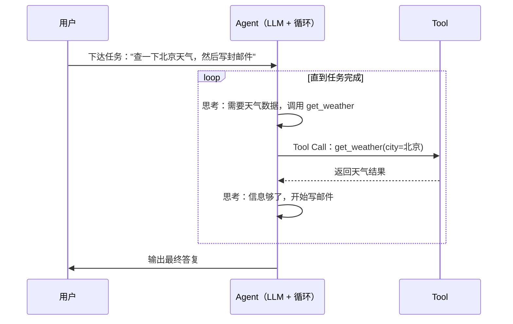
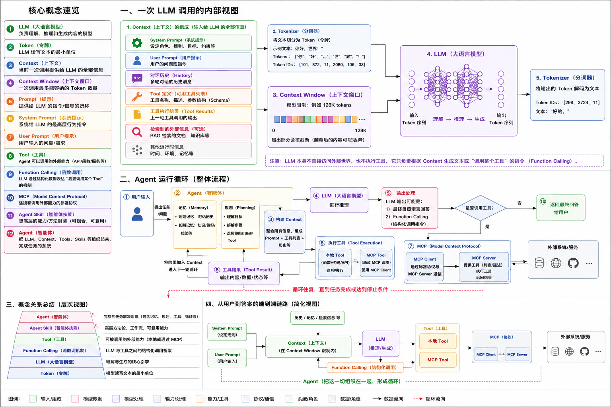

# Agent 核心概念：从 LLM 到 Agent

接触 LLM 应用开发时，我们会被一堆概念包围：Token、Context、Prompt、Tool、MCP、Agent、Skill……它们彼此关联，单独理解任何一个都不难，放在一起却容易混淆。本文按"由内到外"的顺序逐个拆解，并在最后用一张图串起所有概念的关系。

## LLM：一切的起点

**LLM（Large Language Model，大语言模型）** 是在海量文本上训练出来的大规模神经网络模型，本质上只学会了一件事：**给定一段文本，预测接下来最可能出现的 Token**。GPT、Claude、Gemini、DeepSeek、Qwen 都是 LLM。

理解 LLM，先记住它三个最重要的特性：

1. **无状态**：模型本身不记得任何东西。每次请求都是独立计算，所谓"记忆"，其实是把历史对话原样塞回给模型。
2. **只吃 Token**：模型无法直接"阅读"文字，输入必须先被切分成 Token。
3. **只会输出文本**：模型不能执行任何操作，只能生成文本，以及结构化的"调用请求"。

后文的所有概念，几乎都是围绕这三个限制展开的"补全方案"。

## Token：模型的最小计量单位

**Token（词元）** 是 LLM 处理文本的最小单位。它既不是"字"也不是"词"，而是分词器（Tokenizer）按规则切分出的片段。

经验值：

- 英文：1 Token ≈ 3~4 个字符（100 Tokens ≈ 75 个单词）
- 中文：1 个汉字约占 1 个 Token，视分词器略有差异

```text
"I love AI"      -> 大约 4 个 Token
"我爱人工智能"    -> 大约 3~4 个 Token
```

Token 为什么重要？

- **计费按 Token**：API 按输入 / 输出 Token 计费，输出通常比输入贵
- **窗口按 Token**：上下文窗口的容量以 Token 计数
- **性能按 Token**：输入越长，生成越慢、成本越高

## Context 与 Context Window：模型的工作台

**Context（上下文）** 是模型在生成下一个 Token 时"眼前"的全部信息，包括：

- System Prompt（角色与规则）
- User Prompt 与历史对话
- 工具定义、工具调用请求与返回结果

**Context Window（上下文窗口）** 是模型一次请求能处理的 Token 总量上限。类比一下：Context 是工作台上的资料，Context Window 是工作台的大小。

```text
Context        = 本次请求塞给模型的全部内容
Context Window = 这个模型能装下的 Token 上限
```

早期的模型窗口只有 4K~8K，如今旗舰模型普遍在 200K~1M Tokens 之间（例如 Claude Opus 5 为 1M，Haiku 4.5 为 200K），1M Tokens 足以一次性放进一整部《三体》。但窗口再大也是有限的，超长对话、超大代码库仍会撞到上限，于是有了摘要压缩、向量检索（RAG）、自动压缩（Compaction）等策略——那是另一个话题，本文不展开。

一句话：**Context 是内容，Context Window 是容量。**

## Prompt：与模型对话的语言

**Prompt（提示词）** 是发送给模型的指令文本。按角色划分，最常见的是两类：

### System Prompt（系统提示词）

由开发者或应用预设，放在对话的最前面，用于定义角色、规则与边界。优先级最高，整段会话持续生效：

```text
你是一名资深前端工程师。回答请使用中文，代码示例使用 TypeScript。
不要编造不存在的 API，不确定时明确说明。
```

### User Prompt（用户提示词）

用户实际输入的内容，比如"帮我把这段代码重构一下"。

两者的区别可以这样类比：System Prompt 是岗位说明书和员工手册，User Prompt 是领导交办的具体任务。此外，Assistant 消息（模型的回复）也会作为历史回填到 Context 中——这就是模型"记得"前面聊过什么的原因：不是记忆，是回放。

## Function Calling 与 Tool：让模型能"动手"

前面说过，LLM 只会输出文本。那模型怎么查天气、搜网页、读写文件？答案是 **Function Calling（函数调用）**。

**Function Calling 并不是模型真的执行了函数**，而是模型输出一段结构化的"调用请求"（函数名 + JSON 参数），由宿主程序真正执行，再把结果返回给模型：

```json
{
  "name": "get_weather",
  "arguments": { "city": "北京", "date": "2026-08-30" }
}
```

**Tool（工具）** 则是 Function Calling 的产品化封装。定义一个 Tool 通常需要三样东西：

```json
{
  "name": "get_weather",
  "description": "查询指定城市某天的天气",
  "input_schema": {
    "type": "object",
    "properties": {
      "city": { "type": "string", "description": "城市名" },
      "date": { "type": "string", "description": "日期，格式 YYYY-MM-DD" }
    },
    "required": ["city"]
  }
}
```

- `name`：函数名
- `description`：给模型看的"使用说明书"——写得好坏直接决定模型会不会用、用得对不对
- `input_schema`：参数的 JSON Schema，约束模型输出的参数格式

Tools 是 Agent 的手和脚：模型读代码库靠文件工具，跑命令靠 Shell 工具，联网靠搜索工具。

## MCP：工具接入的标准协议

工具好是好，但接入麻烦：每个工具都有各自的接口，接 N 个工具要写 N 套代码，换一个 LLM 客户端又要重来——这就是 M×N 集成问题。

**MCP（Model Context Protocol，模型上下文协议）** 是 Anthropic 于 2024 年 11 月开源发布的开放协议，目标是标准化 LLM 与外部工具、数据源之间的连接，把 M×N 变成 M+N。类比一下：MCP 之于 LLM 工具生态，就像 USB-C 之于外设、HTTP 之于网络服务——只要符合协议，即插即用。

架构上分三层：

```text
┌──────────────────────────────┐
│ Host（Claude Code 等客户端应用）│
└──────────────┬───────────────┘
               │ MCP 协议
┌──────────────▼───────────────┐
│ MCP Client（协议实现）         │
└──────────────┬───────────────┘
               │ 本地（stdio）/ 远程（HTTP）
┌──────────────▼───────────────┐
│ MCP Server（对外提供能力）      │
└──────────────────────────────┘
```

一个 MCP Server 对外暴露三类能力：

- **Tools**：可执行的函数（如查数据库、发消息）
- **Resources**：可读取的数据（如文件、文档）
- **Prompts**：预置的提示词模板

社区已有大量现成的 MCP Server（文件系统、GitHub、数据库、浏览器等），Agent 通过 MCP 接入它们，就获得了开箱即用的能力矩阵。

## Agent：能自主行动的 LLM

工具再丰富，如果没有一个"大脑"决定什么时候用什么工具，也只是散落的零件。这个大脑就是 Agent。

**Agent（智能体）= LLM + Tools + 循环**。普通 LLM 应用是你问一句它答一句；Agent 则拿着任务自主规划：下一步做什么、调用哪个工具、怎么处理结果、何时宣告完成。

Agent 的核心是 **Agentic Loop（代理循环）**：



这个"思考 → 行动 → 观察 → 再思考"的循环（ReAct 模式）会一直重复，直到任务完成或触发停止条件。

需要区分两个容易混淆的词：

- **Workflow（工作流）**：流程由代码预先写死，模型只在节点内干活
- **Agent**：流程由模型自主决定，代码只负责提供工具

你正在用的 Claude Code 就是一个典型 Agent：它拿着文件读写、Shell、搜索等工具，自主决定如何完成你的编码任务。

## Agent Skill：Agent 的技能包

Tool 解决了"能不能做"，Skill 解决"做得好不好"。

**Agent Skill** 是一组预打包的指令、脚本和资源，用来教会 Agent 如何高质量地完成某一类任务，是"知道怎么做"的封装：

- **Tool**：一个函数，单一能力（读文件、查天气）
- **Skill**：一本带工具的"操作手册"，包含完整流程、最佳实践与边界条件（教的是"如何做一次合规的代码审查"，而不是"执行 grep"）

以 Claude Code 为例，每个 Skill 就是一个包含 `SKILL.md` 说明文档（以及可选脚本、资源）的目录，采用**渐进式披露（Progressive Disclosure）**机制：Agent 先只看到 Skill 的名称和简介，判断当前任务需要时，才加载完整内容——这样即使装了几十个 Skill，也不会挤爆 Context Window。

```text
skills/code-review/
├── SKILL.md          # 名称、简介（常驻 Context）+ 详细流程（按需加载）
└── scripts/          # 配套脚本
```

打个比方：Tool 是锤子，Agent 是木匠，Skill 是木工教程——木匠看了教程，才知道怎么用锤子打出好家具。

## 一张图看懂所有关系

把这些概念串起来，完整的关系图如下：



最后会发现，整个 Agent 技术栈的演进逻辑其实只有一句话：**LLM 只会"说"，其余所有概念，都是为了让它能"看"得更远、"做"得更多。**
