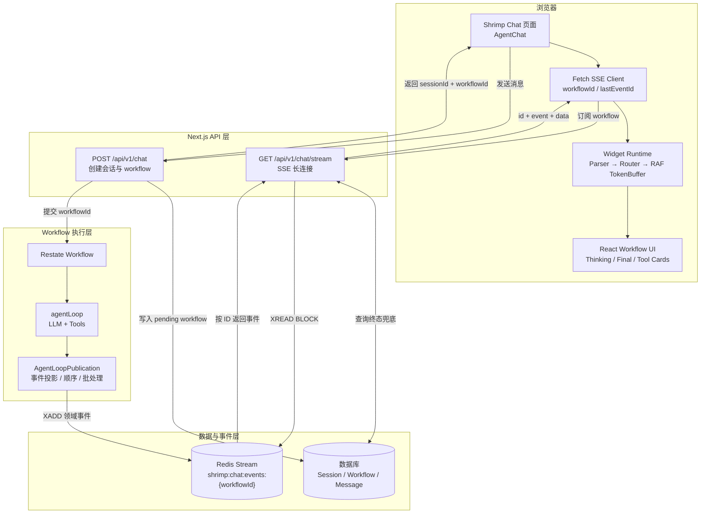
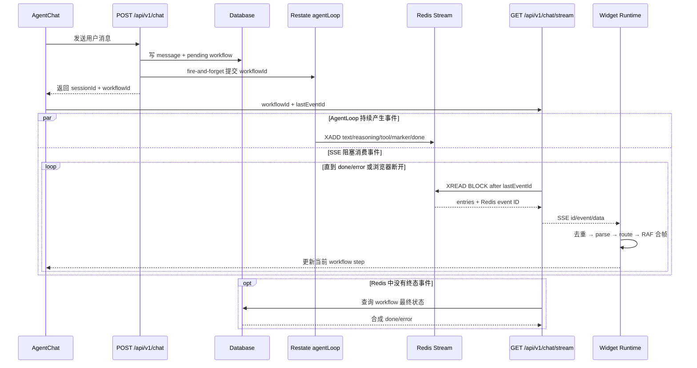
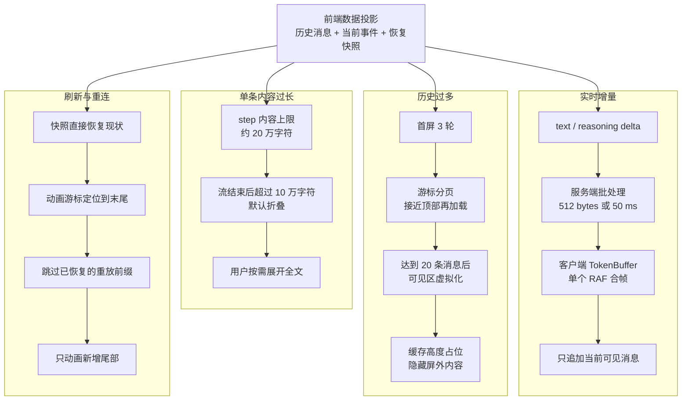
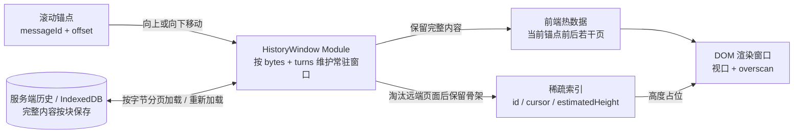

# Shrimp AgentLoop：Redis Stream、SSE 与 Workflow 渲染架构

## 结论先行

Shrimp 的 `agentLoop` **不直接持有 SSE 连接**。它把模型输出翻译成领域事件，通过绑定了 `workflowId` 的 `AgentLoopPublication` 写入 Redis Stream；另一个 HTTP Route 用阻塞 `XREAD` 消费 Redis，再编码成标准 SSE 帧发给浏览器。

前端也不是“每收到一个 token 就直接改 DOM”。Shrimp 页面负责挂载 `AgentChat`；`@bohrium/agent-widget` 负责解析 SSE、按 `stepIndex` 归并 workflow、经 `requestAnimationFrame` 缓冲后更新状态，最后把步骤分类为 thinking、candidate、final 三组并渲染。

需要纠正一个容易误解的说法：**流式文字增长不可能完全不引起 layout/reflow 和 paint/repaint**，因为文本高度会变。代码做的是减少更新次数、限制更新范围、保持节点身份和占位高度，并避免内容先出现在 thinking 区、随后整体跳到 final 区的结构性抖动。

上下文变大时，前端也不会把模型的完整 prompt 一次性渲染出来：历史按 3 轮分页，消息达到 20 条后隔离屏外内容，单个 step 约 20 万字符封顶，静态正文超过 10 万字符默认折叠；刷新或重连则直接恢复快照并跳过已恢复的重放前缀。整个策略的核心是“少接收、少提交、只渲染附近、超长内容按需展开”。但这些机制主要控制首屏和渲染成本，**当前实现并没有为持续加载的历史建立严格的前端内存上限**。

## 一、架构总览：Redis Stream 是 AgentLoop 与 SSE 的边界



这张图里有三条明确边界：

1. `agentLoop` 只负责执行和发布事件，不知道浏览器连接是否存在；
2. Redis Stream 是中间事件总线，承接 `XADD`、有序事件 ID、短期缓存和 `lastEventId` 重放；
3. SSE Route 负责从 Redis `XREAD`、编码 SSE 帧，前端 Widget 负责消费和渲染。

数据库与 Redis 的职责不同：数据库保存 session、workflow、message 等业务事实，也是终态兜底的数据源；Redis 保存面向前端的增量事件流，用来解耦长时间运行的 AgentLoop 与生命周期较短、可能断线重连的 HTTP 连接。Redis 不是 workflow 最终状态的唯一真相。

### 端到端时序



### 1. 先创建 workflow，再异步运行

`POST /api/v1/chat` 创建 `sessionId`、`workflowId`，在事务中写入用户消息和 `pending` workflow，异步提交 Restate workflow，最后立即把两个 ID 返回前端。提交是 fire-and-forget，因此 HTTP 请求不需要等待 agent 完成。

### 2. AgentLoop 获得绑定 workflow 的发布能力

`runChatWorkflow` 把 `ctx.key` 当作 `workflowId`，创建 `createInteractiveAgentLoopRuntime(workflowId)`；这个 runtime 把同一 publication 注入 LLM step 和工具执行上下文。

`createInteractiveAgentLoopPublication` 把 `publish` / `publishOnce` 映射到 `emitChatEvent` / `emitChatEventOnce`。它会检查调用方传入的 workflow 是否与绑定值一致，防止事件串进别的 workflow。

### 3. 模型流被翻译为 UI 事件

LLM provider 的异步流在 `for await` 中被消费：文本、reasoning、工具输入、工具调用/结果、span 等被转换为带 `stepIndex` 的事件。

常见事件可分为：

| 类别 | 事件示例 | 前端用途 |
| --- | --- | --- |
| 内容 | `text-delta`、`reasoning-delta` | 逐步形成正文与思考过程 |
| 工具 | `tool-call-streaming`、`tool-call`、`tool-result` | 形成工具卡片及状态 |
| Trace | `span-start`、`span-end` | 展示执行阶段 |
| 控制 | `workflow-meta`、`final-answer-marker` | 决定 thinking/final 分类 |
| 终态 | `done`、`error` | 提交或恢复 workflow UI |

### 4. Publication 写 Redis，而不是写 HTTP

`emitChatEvent` 先用 `filterEventForFrontend` 做字段投影，再用 `sealFrontendEvent` 执行内容治理，最后通过 `XADD` 写入当前 workflow 的 Redis Stream 并设置 TTL。

逻辑 key 是 `chat:events:{workflowId}`，ioredis 统一加 `shrimp:` 前缀，所以实际 key 为 `shrimp:chat:events:{workflowId}`。

普通文本还会在服务端先做一次有界合并：最多累计 512 UTF-8 bytes 或 50 ms；遇到非文本控制事件时先 flush 文本，保证语义顺序。这同时减少 Redis 写入与 SSE 帧数。

### 5. SSE Route 消费 Redis 并输出标准帧

前端订阅 `GET /api/v1/chat/stream?workflowId=...`。Route 为每条 SSE 使用独立阻塞 Redis 连接，以免与 publisher 或其他 `XREAD` 共用连接导致队头阻塞；每次 `XREAD COUNT 50 BLOCK 50ms`，然后输出：

```text
id: 1723456789012-0
event: text-delta
data: {"stepIndex":2,"delta":"...","ts":"..."}

```

响应显式使用 `Content-Type: text/event-stream`、`Cache-Control: no-cache, no-transform`、`X-Accel-Buffering: no`；Next 配置关闭压缩，避免应用或代理把小帧攒成大块后再下发。

## 二、前端怎样把事件渲染成 workflow

### 1. Shrimp 页面与 Widget 的职责边界

Shrimp 页面只挂载 `AgentChat`，传入 `sessionId`、`workflowId`、fetch、布局和事件回调；SSE parser、workflow reducer 和消息 UI 都在 Widget 包内。

```mermaid
flowchart LR
    Frame["SSE Frame<br/>id / event / data"]
    Transport["Stream Transport<br/>cursor / 去重 / 重连"]
    Parser["Protocol Parser<br/>校验事件结构"]
    Router["Event Router<br/>按事件类型分发"]
    Buffer["TokenBuffer<br/>requestAnimationFrame 合帧"]
    Store["Conversation Store<br/>只更新目标 stepIndex"]
    Classifier["Display Classifier<br/>thinking / candidate / final"]
    Messages["buildChatMessages<br/>稳定 message id"]
    View["MessageList<br/>memo + 虚拟化"]
    Markdown["Streamdown<br/>流式轻量 Markdown"]

    Frame --> Transport --> Parser --> Router
    Router -->|text / reasoning / tool| Buffer
    Router -->|meta / marker / done| Store
    Buffer -->|每帧批量 flush| Store
    Store --> Classifier --> Messages --> View --> Markdown
```



关键点不是让事件绕过 React 直接操作 DOM，而是把网络事件先变成稳定的 workflow 状态：Redis/SSE 负责可靠传输，router 和 store 负责语义归并，classifier 决定内容应处于 thinking 还是 final，React 最后只消费整理好的消息模型。

### 2. 事件经过 parser、router、TokenBuffer、store

Widget 的 fetch shim 把 SSE frame 转成 `{ type, data, lastEventId }`；transport 记录 `lastEventId` 并用 `seen` 集合去重。

stream pipeline 先解析协议事件，再交给 router。router 将 `text-delta`、`reasoning-delta` 和工具生命周期事件送入 TokenBuffer；buffer flush 后才调用 conversation action 更新 store。

conversation action 再按事件类型更新对应 step；`workflow-meta` 写入协议标志，`final-answer-marker` 写入 marker step。store 更新 step 时复制数组、只替换目标 index；marker 只接受更早的值，保证重放和乱序重复不会把边界向后推。

### 3. thinking、candidate、final 的分类

`classifyStepsForDisplay` 以 `stepIndex` 和 `finalAnswerMarkerStepIndex` 分类：

- 流式阶段还没有 marker：已有步骤全部进入 thinking；
- marker 已到，并且最后一步有正文且 `lastIndex >= marker`：最后一步进入 final，其他步骤仍是 thinking；
- 非正常终态：保持 all-thinking；
- 正常完成但没有 marker：最后一个有正文的 step 作为 final 兜底。

`buildChatMessages` 再把各组 flatten 成 message parts；历史 assistant ID 使用 `assistant-${workflowId}`，直播消息使用稳定的 `assistant-live`。

一个细节：锁定版本虽然存储并传入 `usesFinalAnswerProtocol`，但上述 classifier 的流式分支实际只使用 marker 与 `isStreaming`。所以应以当前执行代码为准，不能仅根据后端注释推断“只有 FinalAnswer 协议才会把 marker 前内容放进 thinking”。

## 三、核心：长上下文下如何减少重排与重绘

这里要先区分两个概念：**模型上下文很长，不等于浏览器要渲染整份模型上下文**。AgentLoop 可以把更多历史、工具结果和系统信息放进模型输入；前端得到的是面向 UI 的投影，主要由“分页后的历史消息、当前 workflow 的增量事件、恢复时的 workflow 快照”组成。

因此，前端压力不能只用“上下文长度”描述，而要拆成四类：实时 delta 太密、单条消息太长、历史消息太多，以及刷新或重连时一次恢复太多状态。Shrimp 对四类压力分别降载：



### 1. 实时流：先在服务端降频，再在浏览器合帧

服务端不会把 provider 的每个 token 原样写入 Redis。普通文本最多累计到 512 UTF-8 bytes 或等待 50 ms 后再 flush；控制事件到来时会先清空文本，保持事件顺序。发布侧还有最多 32 个 in-flight 任务的有界队列，避免模型产出速度长期压过 Redis。

浏览器收到 SSE 后也不立即为每个事件触发一次 DOM 更新。TokenBuffer 只登记一个待执行的 `requestAnimationFrame`，在下一帧集中消费 reasoning、text 和 tool 事件；仍有积压时才申请下一帧。积压越多，每帧消费越激进，标签页重新可见时则直接清空积压。

这形成两级削峰：

```text
模型 token → 服务端 512 bytes / 50 ms 合并 → Redis / SSE
          → 浏览器 RAF 合帧 → React store → 当前可见消息
```

它减少的是 Redis 写入、SSE 帧、React commit 和 DOM 更新的次数。当前直播消息仍会变长，所以可见区域的局部 layout 和 paint 仍然存在。

### 2. 历史很多：分页控制数据量，虚拟化控制渲染量

首次进入会话时，前端默认只取最近 3 轮；向上接近列表顶部时再按游标加载更早历史，每页仍以 3 轮为默认粒度。也就是说，长会话不会在首屏一次读取、构建并挂载全部历史。

消息达到 20 条后，列表开始使用可见区虚拟化：

1. `IntersectionObserver` 观察消息是否处于视口附近，预留约 600px 的缓冲区；
2. 消息离开缓冲区一小段时间后，读取并缓存它的 `offsetHeight`；
3. 屏外消息保留固定高度的外层占位，内部内容切到 `display: none`；
4. 再次接近视口时恢复内容，并用 `content-visibility: auto` 与缓存的固有尺寸帮助浏览器跳过不必要的工作；
5. 正在流式输出的最后一条消息强制保持可见，不参与隐藏。

这里的关键不是“把所有旧消息删掉”，而是保留列表几何、让屏外子树暂时不参与布局和绘制。滚动条高度不会因隐藏内容突然缩短，当前直播消息的变化也更难波及整个历史列表。

向上加载旧消息时还需要处理 prepend 跳动：加载前记录第一条可见消息的位置，插入历史后再次测量，用前后差值补偿 `scrollTop`。这会产生受控的布局读取和滚动写入，但能避免用户正在阅读的内容被新插入的节点顶走。

### 3. 关键边界：虚拟列表不等于内存虚拟化

如果历史数据总量达到 1GB，并且用户不断向上翻页把它全部加载进浏览器，**当前实现仍然可能耗尽内存**。原因是现有机制只解决了“浏览器要不要布局和绘制这条消息”，没有完整解决“这条消息的数据是否还常驻内存”。

当前链路是：

```text
分页接口 → prepend 到 turns store → 派生 ChatMessage → 屏外 MessageBubble 设为 display:none
```

其中：

- 分页只让数据分批进入，不会自动淘汰已经加载的旧页；持续翻页后，`turns` 仍会增长；
- `display: none` 会跳过屏外内容的布局与绘制，但消息字符串、对象引用、React 子树和 DOM 节点仍然存在；
- 静态正文“只显示前 10 万字符”只是渲染截断，为了支持“显示全文”，完整字符串仍需要保留；
- 自动分页连续触发 3 页后会暂停并要求用户继续，这能防止一次意外拉取很多页，但不是总内存上限；
- Widget 虽然提供可选的冷区 turn 压缩，但 Shrimp 当前没有启用；即使启用，它也只是清空冷区 assistant 的正文、reasoning 和工具输出，保留 turn 骨架，并不是按字节预算淘汰页面。

而且 1GB 网络数据进入浏览器后，峰值占用通常会高于 1GB：响应文本、JSON 解析结果、Zustand/React 对象、Markdown 中间结果和 DOM 可能在一段时间内同时存在。因此不能把“接口数据 1GB”直接等同于“只占 1GB 内存”。

#### 真正支持超长历史，需要三层虚拟化



这里应该在“历史数据源”和“Conversation store”之间放一个深的 `HistoryWindow` module。调用方只需要知道少量 interface：给定滚动锚点和方向加载页面、读取当前热窗口；module 内部负责以下实现细节：

1. **接口按字节分页**：除了 `limit=3 turns`，还要有 `maxBytes`，避免一轮消息就带回几百 MB；
2. **常驻窗口有硬预算**：同时限制 `maxResidentBytes` 和 turn 数，只保留当前视口前后若干页；
3. **双向淘汰**：向上加载旧页时淘汰离视口最远的底部页，向下返回时再从服务端或 IndexedDB 重新加载，内存不随滚动距离单调增长；
4. **冷区只留稀疏索引**：保留 message ID、游标、估算高度和状态摘要，不保留完整正文、Markdown AST、工具输出或 DOM 子树；
5. **当前 workflow 必须 pin**：正在流式输出、HITL 等待中或用户正在操作的消息不能被淘汰；
6. **单条超大内容还要分块**：如果一条消息本身非常大，应使用 range/chunk 接口和块级 Markdown 渲染，不能先构造一个 1GB 字符串再做 UI 折叠；
7. **淘汰时保持滚动锚点**：用累计估算高度维持占位，重新加载后再用实测差值校正 `scrollTop`。

三层职责必须分开：服务端分页控制网络批次，`HistoryWindow` 控制 JS heap，DOM 虚拟列表控制 layout/paint。只做第三层，页面可能看起来很顺，但内存仍然会持续上涨。

### 4. 单条很长：限制进入渲染链的数据，并按需展开

历史条数少并不代表页面一定轻量，一条超长回答同样会拖慢 Markdown 解析与 DOM 构建。因此系统还有内容级上限：

- 单个 step 的 text 或 reasoning 在实时发布和快照恢复链路中最多保留约 20 万字符，超过后停止继续向前端堆积，并给出截断提示；
- 消息结束后，单条静态正文超过 10 万字符时默认只渲染前 10 万字符，用户可以主动“显示全文”；
- 流式过程中不做这层 10 万字符的 UI 折叠，否则不断切换截断边界会破坏打字体验；实时阶段由上游约 20 万字符的 step 上限兜底。

“显示全文”是明确的性能换功能开关：用户展开后，完整 Markdown 仍需要解析、布局和绘制，系统不能同时保证全文立即可见和零成本渲染。

### 5. 刷新与重连：恢复现状，不把历史内容重新打字

刷新后先用快照直接恢复 workflow；TokenBuffer 的动画游标被定位到已有内容末尾，因此快照中的长文本不会从头播放一遍。

如果 SSE 又从较早的 Redis ID 开始重放，客户端会把已由快照恢复的 text/reasoning 作为前缀静默消费，只把真正新增的尾部送进 RAF 动画。这同时避免重复内容、重复 React 更新和页面高度再次增长。

### 6. 保持结构稳定，比单纯减少 repaint 更重要

后端在识别 FinalAnswer 时，会先等待幂等的 `final-answer-marker` 写入 Redis，再发布后续正文。前端因此能在第一段正文到达前确定它属于 thinking 还是 final，避免整段内容先出现在 thinking，随后被搬到 final 所产生的结构性跳动。

消息使用稳定 ID 作为 React key，相邻 text/reasoning 片段也会合并，减少碎片节点。不过稳定 key 只是保持节点身份，不等于阻止所有 render：当前实现会在流式更新时重新派生消息对象，直播气泡必然更新，历史气泡也不能只凭 `memo` 就保证每帧完全跳过协调。

Markdown 流式增长时暂缓代码高亮、Mermaid 等高开销增强，只保留较轻的流式解析；输出完成后再切回完整静态渲染。这样避免每个 delta 都重复执行重型插件，但普通 Markdown 解析和可见 DOM 更新依然存在。

### 7. 准确的性能边界

| 压力来源 | 主要机制 | 被限制的成本 | 仍然存在的成本 |
| --- | --- | --- | --- |
| 实时 delta 太密 | 服务端批处理 + RAF 合帧 | Redis、SSE、React 更新频率 | 当前消息增长时的局部 layout / paint |
| 历史消息太多 | 3 轮分页 + 20 条后渲染虚拟化 | 首屏数据量、屏外布局与绘制 | 已加载数据仍常驻；持续翻页没有严格内存上限 |
| 历史总量达到 GB 级 | 需要有字节预算的 `HistoryWindow` + 双向淘汰 | JS heap 随滚动距离增长 | 当前 Shrimp 尚未实现这层数据虚拟化 |
| 单条消息太长 | 约 20 万字符上限 + 静态 10 万字符折叠 | Markdown 解析量、DOM 规模 | 用户展开全文后的完整渲染成本 |
| 刷新或断线重连 | 快照 seed + 跳过重放前缀 | 重复动画、重复追加和高度二次增长 | 新增尾部仍需正常渲染 |
| thinking / final 分区 | marker 先于正文 | 跨区域搬运造成的布局跳动 | 正常打字造成的局部变化 |

所以 Shrimp 的目标不是“零重排、零重绘”，而是：**把不可避免的更新限制在当前可见消息和动画帧内，把长历史移出活跃渲染区，把超长正文变成按需成本，并保持列表高度与 workflow 分区稳定。** 但如果目标是支持 GB 级历史，还必须补上有字节预算、可双向淘汰的数据窗口；渲染虚拟化本身不提供内存安全保证。

## 四、断线续传和终态可靠性

服务端接受 query `lastEventId` 或 `Last-Event-ID` header，默认 cursor 为 `0`，因此首次连接也能重放已存在的 Redis entries；每 15 秒发送 heartbeat。浏览器断开时会清 timer、关闭阻塞 Redis 连接和 stream controller。

Widget transport 保存最新 ID、去重已见事件，并在重连 URL 中补 `lastEventId`。如果 Redis 没读到终态，Route 空闲后会查询数据库并合成终态事件；`done` 或终态 `error` 到达后关闭流。

## 五、可复用的工程认识

1. **执行与传输解耦**：AgentLoop 只依赖 publication capability，Redis Stream 负责把 durable workflow 与短生命周期 HTTP 连接隔开。
2. **事件顺序也是 UI 契约**：marker 必须先于正文，不只是数据正确性问题，而是布局稳定性问题。
3. **削峰发生在两端**：服务端合并 token，前端再按帧消费；两个缓冲层分别保护 Redis/网络和 React/浏览器。
4. **渲染虚拟化不等于数据虚拟化**：`display:none` 或 `content-visibility` 保护的是渲染流水线；只有按字节预算淘汰 store 中的远端页面，才能保护 JS heap。
5. **不要承诺零 reflow/repaint**：流式文本天然改变几何。合理目标是减少次数、缩小范围、保持占位与节点身份，并用 Chrome Performance 的 Layout/Paint/Long Task 数据验证。
