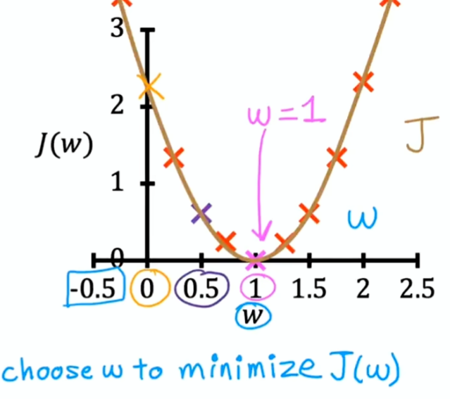
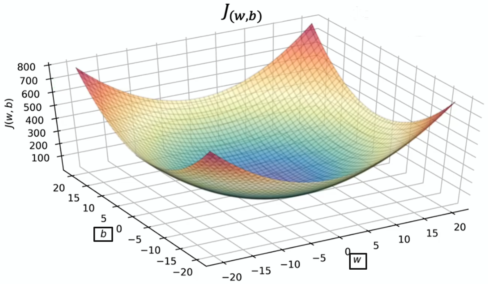

# 成本函数（Cost Function）

## 什么是成本函数

成本函数用来衡量模型预测得有多差：把每个样本的预测值 ŷ 和真实值 y 的差距汇总成一个数。这个数越小，说明模型拟合得越好；训练模型的目标，就是找到让成本最小的 w 和 b。

**损失函数（Loss Function）与成本函数** —— 损失函数衡量单个样本的误差，成本函数衡量整个训练集上的平均误差，两个词经常混用。

## 平方误差成本函数

线性回归最常用的成本函数是平方误差成本函数（Squared Error Cost Function），其中 f(x⁽ⁱ⁾) = wx⁽ⁱ⁾ + b 是第 i 个样本的预测值：

`J(w,b) = (1 / 2m) Σ (f(x⁽ⁱ⁾) − y⁽ⁱ⁾)²`

**误差（error）** —— 单个样本的预测值和真实值之差：f(x⁽ⁱ⁾) − y⁽ⁱ⁾。

**平方（squared）** —— 把误差平方：全部变成正数，并且放大大的误差，惩罚更狠。

**求和并平均（1 / 2m）** —— 先对所有样本求和，再除以 m 取平均；多除的 2 没有特殊含义，只是让后面求导时消掉平方带来的系数，计算更简洁，不影响最小值的位置。

## 直观理解

**简化情形：b = 0，只有 w 一个参数** —— J(w) 是一条开口向上的抛物线（parabola），抛物线最低点对应的 w 就是最佳参数。

**完整情形：w 和 b 两个参数** —— J(w, b) 是一个碗形的三维曲面（bowl shape），碗底就是成本最小的位置；用等高线图（contour plot）看，一圈圈椭圆的中心就是碗底。

## 如何找到最小的成本

成本函数定义了「差多远」，还要一个方法自动找到让成本最小的参数，这就是梯度下降（Gradient Descent），详见[梯度下降](./gradient-descent.md)。
