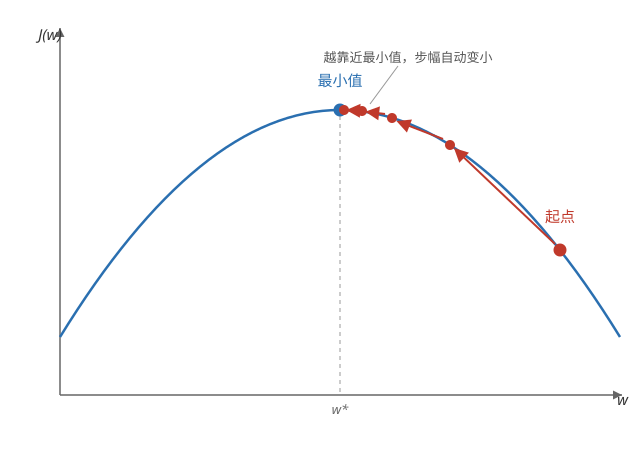
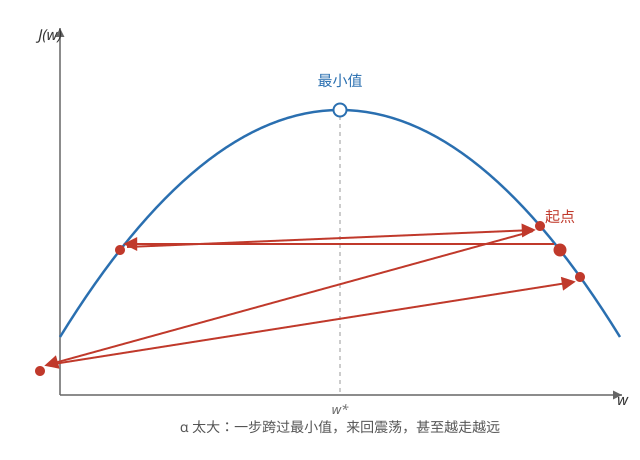

# 梯度下降（Gradient Descent）

## 梯度下降的用途

梯度下降在机器学习中广泛被使用，不仅用于线性回归，还用于训练一些最先进的神经网络（Neural Network）模型，这些模型也称为深度学习（Deep Learning）模型。

## 什么是梯度下降

想象你站在山顶，想最快下山：每到一个位置就环顾四周，朝最陡的下坡方向迈一步，重复这个过程，直到走到谷底。梯度下降就是在成本函数上找最小值的方法：每一步都朝「最陡下降」的方向移动一点点，直到不能再下降为止。

**梯度（gradient）** —— 函数在某一点上升最快的方向。梯度下降沿梯度的反方向走，也就是下降最快的方向。

## 梯度下降算法

每一步同时更新参数 w 和 b：

```math
w = w - \alpha \frac{\partial J(w, b)}{\partial w}
```

```math
b = b - \alpha \frac{\partial J(w, b)}{\partial b}
```

重复这两个更新，直到收敛（convergence），即参数不再明显变化。

**学习率（learning rate）α** —— 控制每一步迈多大，通常取 0 到 1 之间的小数，例如 0.01 或 0.1。

**导数项（derivative）** —— 决定前进方向：$\frac{\partial J}{\partial w}$ 为正，说明 w 增大时成本变大，所以要把 w 减小；为负则相反，要把 w 增大。

**同时更新（simultaneous update）** —— 两个参数必须同时更新：先用旧的 w、b 算出两个新值，再一起赋值。如果先更新 w，再用新 w 计算 b 的更新，得到的就不是梯度下降了。

## 直观理解



**导数为正，w 减小** —— 在最小值右侧切线斜率为正，梯度下降把 w 往左移；在左侧斜率为负，把 w 往右移。每一步的方向都指向最小值。

**已经在最小值处** —— 导数为 0，参数不再更新，模型停在原地——这正是想要的结果。

**步幅自动变小** —— 越靠近最小值导数越小，每步迈得越小，所以不需要随时间手动调小学习率。

## 学习率的选择

**α 太小** —— 每一步只挪一点点，需要非常多步才能到达最小值，收敛太慢。

**α 太大** —— 一步可能跨过最小值，在两边来回震荡，甚至越走越远，永远无法收敛（发散，divergence）。



**怎么选 α** —— 没有通用公式，常见做法是从小到大依次尝试，例如 0.001、0.003、0.01、0.03、0.1、0.3……每轮迭代后画出 J 随迭代次数的曲线来检查：J 单调下降，说明 α 合适；J 震荡甚至上升，说明 α 太大，换更小的值再试。

**收敛的判断** —— J 在多轮迭代中几乎不再下降，或每步更新的幅度已经很小，就可以认为梯度下降收敛了。

## 线性回归的梯度下降

把平方误差成本函数代入梯度下降，求出偏导数后得到：

```math
w = w - \alpha \frac{1}{m} \sum_{i=1}^{m} \left( f(x^{(i)}) - y^{(i)} \right) x^{(i)}
```

```math
b = b - \alpha \frac{1}{m} \sum_{i=1}^{m} \left( f(x^{(i)}) - y^{(i)} \right)
```

**误差项被重复使用** —— 每个样本的误差 $(f(x^{(i)}) - y^{(i)})$ 同时驱动两个参数的更新：更新 b 时误差乘 1，更新 w 时误差乘对应的特征 $x^{(i)}$。

**为什么一定能找到最小值** —— 平方误差成本函数是凸函数（convex function），形状像一个碗，只有一个全局最小值。无论从哪个 w、b 出发，只要学习率合适，梯度下降都能收敛到全局最小值。注意：对一般函数不一定成立，梯度下降可能停在局部最小值（local minimum）。

## 批量梯度下降

**批量梯度下降（Batch Gradient Descent）** —— 上面的算法每一步都扫过全部 m 个训练样本再求和，因此叫「批量」。其他常见变体：随机梯度下降（Stochastic Gradient Descent）每一步只用 1 个样本；小批量梯度下降（Mini-batch Gradient Descent）每一步用一小部分样本。
