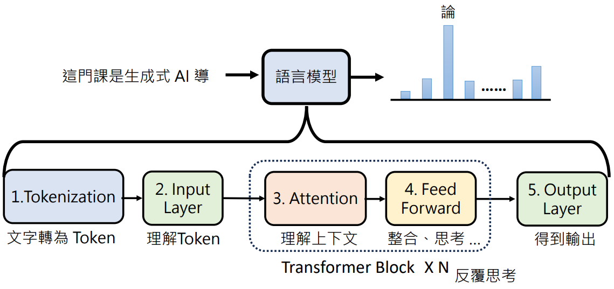
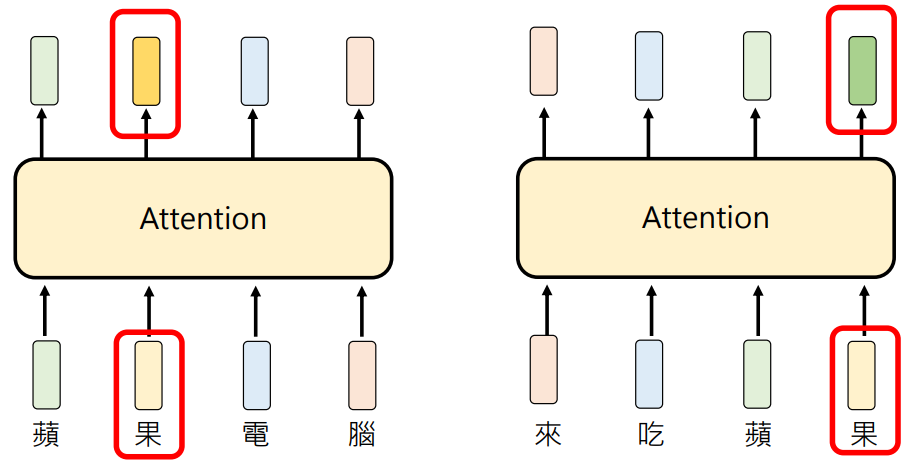

# 生成式人工智能随想笔记

## 模型的三种学习方式

**预训练：提前广学** —— 先拿海量数据提前"看书学习"，掌握通用规律，不是任务开始才从零学。好比 AI 事先看过成千上万车床加工案例，脑子里已有经验储备。

**监督式学习：照答案学** —— 有标准答案教它：输入 → 人为给好正确输出，模型学着模仿。就像给很多"图纸 → 正确走刀路径"样本，学会"图纸该怎么加工"，但只能学已给的模式，不会创新——老式数控就是这个逻辑：程序是给定好的标准答案，严格照做。

**增强式学习：试错自学** —— 没有标准答案，只有奖励/惩罚。模型自己试错，做得好给奖励，不好就扣分，慢慢摸索出最优方案。也叫强化学习（Reinforcement Learning）。它也有缺点和难点：什么叫"好"本身就很难定义——比如"安全"，什么样的行为该奖励、什么样的该惩罚？标准模糊，连人类自己都常常说不清。

## 概念速记

**督导式学习（Supervised Learning）** —— 人类提供的资料来学习，就叫督导式学习：资料里自带"正确答案"，模型照着模仿。就是上文「模型的三种学习方式」里的监督式学习（照答案学），叫法不同。

**指令微调（Instruction Fine-tuning）** —— 拿人类提前准备好的资料来训练模型，就叫指令微调。这些资料是"指令 → 正确回答"的示范样本，模型照着模仿，学会听懂人话、按指令办事。本质上是督导式学习的一种：答案由人类亲手写好，模型学的就是"照人类的样子回答"。

**资料标注（Data Annotation）** —— 耗费大量人力生成的资料，就叫资料标注。上面指令微调用的"指令 → 正确回答"样本，正是靠人工一条条标注出来的：人力越足、标得越细，资料质量越高。

**LoRA（Low-Rank Adaptation，低秩适配）** —— 是 adapter（适配器）的一种。adapter 的思路：模型主体冻结不动，只训练额外的小模块，省算力；LoRA 是其中最常用的一种——不加新模块，而是用两个小矩阵去近似"参数该改多少"（低秩分解），只更新这两个小矩阵，成本比全量微调低得多，效果却接近。

**RLHF（Reinforcement Learning from Human Feedback，基于人类反馈的增强式学习）** —— 它也是增强式学习（Reinforcement Learning，即上文「试错自学」）的一种：让人类当"裁判"，对模型的回答打分、排序，模型拿这些反馈当奖励信号调整自己，越答越合人意——相当于把「试错自学」里的奖励换成人给的反馈。人类打分这一步，本身也是一种资料标注。

## Transformer

**Embedding（嵌入）** —— 把每个 token 变成一个向量的过程，就叫 embedding：文字本身机器不认得，先变成一串数字（向量），模型才能计算。

**位置编码（Positional Encoding）** —— 把每个 token 的位置信息加进去，就叫位置编码。Transformer 同时看整句话、分不清先后，把"第几个位置"也写进向量，模型才知道顺序。

**Contextualized Token Embedding（上下文相关的词嵌入）** —— 考虑上下文的 embedding：每个 token 的向量不再是固定的，而是随周围的词变化。比如"苹果"在"吃苹果"和"苹果手机"里含义不同，向量也不同——Transformer 靠注意力机制把上下文信息融进每个 token 的向量。

**Attention（注意力）** —— 相关性计算：让每个 token 去"看"句子里其他 token，算出跟每个 token 的相关程度（注意力权重），相关度高的就多参考它的信息——上下文相关的 embedding 就是靠它融出来的。

**Feed Forward（前馈网络）** —— 注意力做完相关性计算后，每个 token 的向量还要各自过一个小型全连接网络，进一步加工——这个网络就叫 feed forward。它独立作用于每个 token，把注意力融来的信息再"消化"一遍。

## 思维链家族：链 → 树 → 图

思维链最大的毛病是"一步错，步步都错"，后面几种都是在想办法解决这一点。

**思维链（Chain of Thought）** —— 让模型一步一步思考，把推理过程显式写出来，提高准确率。缺点是"一条道走到黑"：前面错了，后面顺着错误一路走下去。

**思维树（Tree of Thought）** —— 思维链是一条路走到底，思维树是每个路口都试试：每个节点生成多个候选分支，先评估，挑有希望的往下走，走不通还能回溯。就像下棋：几种走法都摆出来，评估后再落子。代价是计算量和 token 消耗大得多。

**思维算法（Algorithm of Thoughts）** —— 把推理本身当成算法来教：给模型演示"推理的搜索过程"作示例，让它照着算法步骤自己推演，而不是每条分支都真跑一遍。相当于思维树的高效版，省 token。

**思维图（Graph of Thoughts）** —— 在思维树基础上更进一步：想法是节点，节点间不只有"父子"关系，还可以合并、聚合、循环，多个分支的思路能汇聚成一个结论。比树更灵活，但也最复杂。

**和 Agent 设计模式的关联** —— 思维链、思维树、思维图正好对应《Agent设计模式》笔记下篇的「推理」类别模式表：[推理（4）：思维链 / 思维树 / 思维图 / 类比推理](../../reading/agent-design-patterns#下篇21-个智能设计模式速览)。
