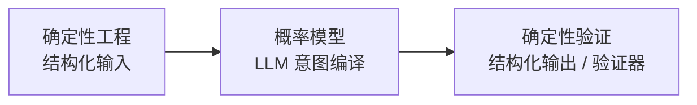

# Agent设计模式：图解可复用智能体架构

> 读后总结

## 一句话总结

这本书把 Agent 设计放回软件工程的历史谱系里讲：从 GoF 设计模式到 Kubernetes，再到"软件 2.0"，Agent 不是凭空冒出来的新概念，而是软件范式从「确定性结构」走向「概率性智能」的自然结果。全书的落地心法是一句话——**用确定性工程夹住中间的概率模型**，即三明治架构（Sandwich Architecture）。

## 上篇：智能设计的哲学（思想地基）

### 第1章 从结构到智能：设计模式的世纪旅程

- GoF（Gang of Four）23 种设计模式诞生于 1994 年，灵感源自建筑师 Alexander 的《建筑模式语言》（A Pattern Language）。它最大的遗产不是那 23 个套路，而是一套**「压缩的行话」（compressed jargon）**——几个词就能让工程师对齐复杂的设计意图。模式的价值在沟通，不在套用。
- **「模式病」（Patternitis）**：为用模式而用模式，导致过度设计。经典模式建立在确定性假设之上，一旦面对规模、行为、需求三重不确定性就接连失效（2008 年 Twitter 宕机是「确定性失效」的典型）。
- 结论：软件范式从「确定性结构」走向「概率性智能」是必然。

### 第2章 从模式到意图：软件工程的范式迁移

通往 Agent 的三级台阶：

1. **计算原子化**：函数式（Functional）、响应式（Reactive）编程
2. **分布式解耦**：微服务（Microservices）、Kubernetes 声明式编排、Serverless
   - 书中金句：**K8s 本质是一个低智能但高可靠的 Agent**——「声明期望状态 → 控制循环不断调和」的结构，与 Agent 的「意图—行动」循环同构
3. **概率与代码的融合**：Karpathy 的「软件 2.0」（Software 2.0）时代

核心公式：**输出 = f(权重, 上下文)**

三明治架构（Sandwich Architecture）心法：

### 第3章 从设计到演化：欢迎来到 Agent 时代

- **Agent 本质 = 意图编译器（Intent Compiler）**：把模糊的自然语言实时编译为可执行动作，分四层——语义理解 → 目的识别 → 上下文关联 → 风险评估
- **心智架构**：感知—推理—行动（OODA Loop 的软件化）
- **上下文工程（Context Engineering）**：**「上下文就是 Agent 的整个世界」**
- **多 Agent 协作的语法**：角色、协议、拓扑、涌现
- **人机协作四原则**：互补而非替代、透明可解释、人类保持主导权、共同学习成长

## 下篇：21 个智能设计模式速览

每个模式按「结构图—核心机制—工程实现—演化组合—哲学启示」五段式展开：

| 类别 | 模式 | 核心机制 | 一句话精华 |
| --- | --- | --- | --- |
| **感知（3）** | 注意力聚焦 Attention Focusing | 认知漏斗（Cognitive Funnel） | 最低 Token 成本换最高上下文质量 |
| | 多模态融合 Multimodal Fusion | 统一语义场 | 整合文字、图像等异构输入 |
| | 主动感知 Active Perception | 信息觅食环（Information Foraging） | 从被动答题者变成主动调查员 |
| **记忆（3）** | 分层记忆 Hierarchical Memory | 分层存储 + 动态换页 | 突破上下文窗口限制 |
| | RAG Retrieval-Augmented Generation | 检索与生成的交响 | 实现知识解耦 |
| | 情节记忆 Episodic Memory | 带时空上下文的轨迹闭环 | 让 Agent 记住「经历」而不只是「知识」 |
| **推理（4）** | 思维链 Chain of Thought (CoT) | 显式过程分解 | 提升准确性与可解释性 |
| | 思维树 Tree of Thoughts (ToT) | 探索—评估—回溯 | 应对全局规划 |
| | 思维图 Graph of Thoughts (GoT) | 引入合并与循环 | 比树更灵活的推理拓扑 |
| | 类比推理 Analogical Reasoning | 结构映射 | 迁移过往案例解决新问题 |
| **行动（4）** | ReAct Reasoning + Acting | 思考—行动—观察微循环 | Agent 的基础动作单元 |
| | 规划—执行 Plan-and-Execute | 任务分解 + DAG 调度 | 掌控长程任务 |
| | 工具编排 Tool Orchestration | 标准化接口 + 智能选择 | 调度海量外部能力 |
| | 自适应策略 Adaptive Strategy | 强化学习 / 多臂老虎机（Multi-armed Bandit） | 平衡探索与利用 |
| **反思（3）** | 自我修正 Self-Refinement | 自动识别幻觉、逻辑错误、代码漏洞 | 让 Agent 能纠自己的错 |
| | 反思记忆 Reflective Memory | 失败经验语义化为长期记忆 | **失败是资产** |
| | 元学习 Meta-Learning | 收集执行轨迹自动迭代优化 | **「提示工程师的消亡」** |
| **协作（4）** | 辩论 Debate | 多 Agent 对抗性交互 | 揭示彼此盲点 |
| | 委托 Delegation | 有向树分而治之 | 缓解单体上下文瓶颈 |
| | 路由 Routing | 星形网络 | 去中心化生态 |
| | 群体 Swarm | 异构 Agent 集群 | 追求整体最优与性价比 |

## 小结

上篇讲清了「为什么」（范式迁移的必然性），下篇给出了「怎么做」（21 个模式的选型工具箱）。以后做 Agent 相关项目时，可以先用这张 21 模式清单做选型，再套三明治架构落地：感知/记忆管输入质量，推理/行动管执行，反思管迭代，协作管规模。
